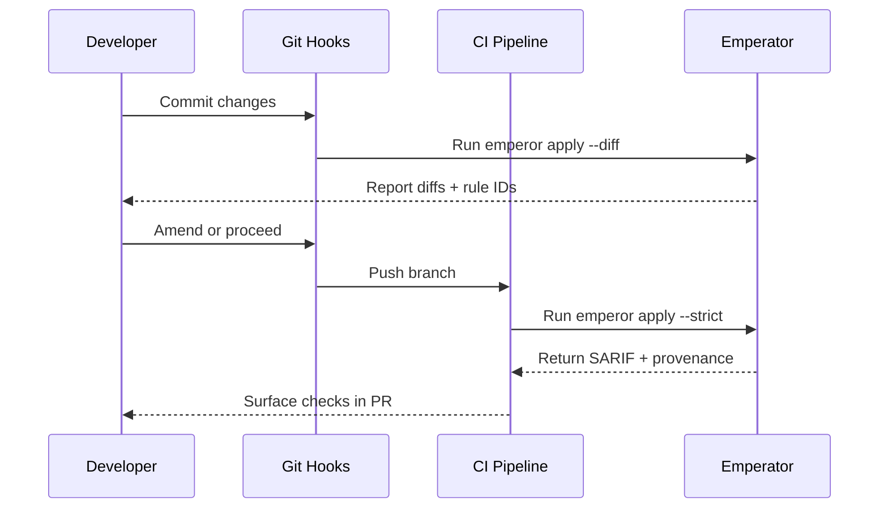

# Developer Experience Integration

Emperator is designed to feel like a teammate that automates busywork while keeping developers in control. This overview highlights key workflow touchpoints.

## One-command ergonomics

- `emperor apply` defaults to a dry run that lists checks, fixes, and suggestions so developers can review diffs before committing.
- Rich console output cites rule IDs, contract evidence, and remediation steps, turning enforcement into a learning moment instead of a cryptic failure.
- Exit codes align with CI expectations (`0` clean, `1` violations remaining) so Emperator slots into existing automation easily.

## Git-native workflows

- Pre-commit integration (`entry: emperor apply --diff --color`) keeps local commits compliant without manual linting.
- CI pipelines can run fast (`--fast`) or full (`--strict`) modes and upload SARIF for inline review comments.
- Auto-applied fixes carry provenance markers (rule id, contract version) in commit messages, making audit trails obvious.

## Editor feedback loops

- The optional LSP server surfaces contract violations as diagnostics and offers quick fixes when codemods are available.
- VS Code and other LSP-aware editors can trigger Emperator on save, providing near-real-time feedback backed by Tree-sitter’s incremental parsing.
- Snippets and commands scaffold new modules or handlers based on OpenAPI and contract templates to accelerate feature startup.

## Config minimalism

- The Project Contract is the single source of configuration; Emperator infers tool settings (formatters, Semgrep rule packs, CodeQL queries) automatically.
- Profiles let teams roll out enforcement gradually—warn-only for newcomers, strict mode for protected branches.
- Verbose logs and dry-run modes help teams debug new rules before flipping them to blocking status.

## Language tooling {#language-tooling}

- Emperator installs formatter and lint stacks per language as defined in the [Toolchain Matrix](../reference/toolchain.md#recommended-lint-and-formatter-stacks), keeping local editors and CI pipelines aligned.
- Contract metadata advertises which tools run automatically, so teams can configure editor integrations (e.g., Ruff or Prettier on save) without guessing.
- Language owners can enable experimental analyzers behind profiles, gradually rolling them out as developers provide feedback.

## Respecting developer time

- Incremental analysis daemons cache IR so routine runs complete in seconds even on large codebases.
- Idempotent codemods and formatter passes prevent noisy diffs, keeping pull requests focused on substantive changes.
- Clear waiver workflows and rule ownership metadata ensure developers know exactly whom to involve when they need exceptions.

A smooth developer experience is foundational to adoption; Emperator’s tooling aims to reduce friction so teams can spend energy on product work rather than policing standards manually. Consult the [Developer Tooling reference](../reference/developer-tooling.md#baseline-stack) when provisioning workstations or Dev Containers.
