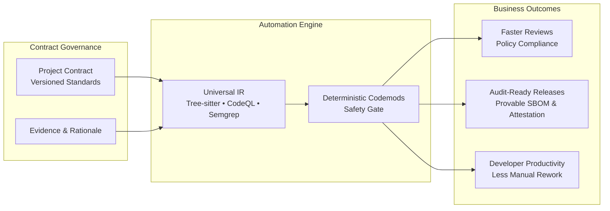
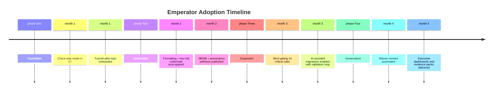

# Executive Summary

Emperator turns your software standards into enforceable automation that keeps codebases secure, consistent, and audit-ready. The platform compiles a versioned Project Contract into multi-language analysis, deterministic codemods, and scaffolded assets so teams can adopt best practices without slowing delivery.

## Why Emperator

- **Unified Contract → IR → Action loop:** Encode expectations once and let Emperator translate them into checks, fixes, and generators across every repository.
- **Evidence-backed assurance:** Triangulated findings (Tree-sitter, Semgrep, CodeQL) and signed provenance artefacts give auditors confidence in rule enforcement.
- **Developer-first experience:** Pre-commit hooks, LSP diagnostics, and precise diffs make compliance part of the normal workflow rather than an afterthought.
- **Supply chain integrity:** Automatic SBOMs, in-toto attestations, and policy-as-code keep releases aligned with SLSA targets.
- **Safe automation:** Safety tiers, property-based testing, and rollback guarantees ensure that auto-applied changes never surprise reviewers.

## Key capabilities at a glance

| Capability | Highlights | Docs |
| --- | --- | --- |
| Contract authoring | OpenAPI, CUE, Rego scaffolds, review workflow | how-to/author-contract.md |
| Static analysis | Polyglot IR, curated rule packs, AI-augmented suggestions | explanation/system-architecture.md, reference/toolchain.md |
| Automation & CI | Pre-commit integration, pipeline templates, SBOM/provenance | tutorial/getting-started.md, how-to/ci-integration.md |
| Governance | Waiver audits, compliance checklist, signed artefacts | reference/governance.md, explanation/devsecops-supply-chain.md |
| AI assistance | Local-model propose → rank → validate loop | how-to/ai-assisted-refactors.md, explanation/ai-orchestration.md |

## Executive visuals

!!! tip "Adopt Emperator Gradually"
    1. **Start in check-only mode:** Run `emperator check --format sarif` in CI to surface gaps without blocking merges.
    2. **Pilot auto-fixes on low-risk rules:** Enable formatting and trivial codemods in a staging repo; confirm tests stay green.
    3. **Expand coverage iteratively:** Promote rules to `--strict` once teams trust the output, then introduce higher-tier codemods with safety gating.
    4. **Instrument metrics:** Track violations resolved, runtime, and waiver trends to prove ROI and identify where to invest next.

## Recommended rollout narrative

1. **Assess the baseline:** Use the tutorial to index an existing project, reviewing the initial findings report with architecture and security leads.
2. **Define success metrics:** Agree on target reduction in manual review comments, critical security findings, or dependency drift.
3. **Automate the pipeline:** Integrate the CI template, generate SBOM/provenance artefacts, and ensure stakeholders can access the reports.
4. **Enable AI with guardrails:** Once deterministic automation is stable, opt in to AI-assisted refactors for complex migrations, keeping validation in place.
5. **Operationalize governance:** Schedule recurring waiver reviews, sign releases, and store evidence packs for audits—completing the contract-as-code loop.

Use this summary to brief executives, security stakeholders, or new team members before diving into the detailed sections of the technical brief.
