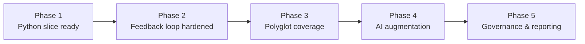

# Implementation Roadmap

The roadmap provides a pragmatic sequence for delivering Emperator, starting with a focused Python slice and expanding once the core pipeline proves reliable.

## Phase 1: Python-focused slice (6–8 weeks)

- **Contract parsing:** Support CUE-based naming and layering rules, a small Rego policy for security, and an OpenAPI snippet to drive scaffold generation.
- **IR construction:** Integrate Tree-sitter for Python, run targeted Semgrep rules, and generate a CodeQL database for selected semantic checks.
- **Checks:** Detect naming convention violations, forbidden imports across layers, and insecure shell execution.
- **Fixes:** Auto-rename identifiers via LibCST, run Ruff/Black formatters, and scaffold missing handlers implied by the contract.
- **Safety:** Re-run checks after fixes and execute at least one property-based test (e.g., DTO round-trip) to show the safety envelope in action.
- **CLI experience:** Deliver `emperator apply` with diff output, summaries, and exit codes suitable for pre-commit and CI.
- **Demo project:** Curate a sample repo exhibiting each violation type to showcase before/after results.

## Phase 2: Developer feedback loop {#phase-2-rollout}

- Pilot the tool with real teams to gather usability data, measure runtime, and identify noisy rules.
- Harden pre-commit and CI integrations, including SARIF uploads and provenance artefact capture.
- Expand documentation and tutorials based on pilot feedback, especially around waiver workflows and troubleshooting.

## Phase 3: Polyglot expansion {#phase-3-organization-wide-enforcement}

- Add Java/OpenRewrite support, then JavaScript/TypeScript with ESLint or TypeScript AST integrations.
- Broaden Semgrep and CodeQL rule packs, including organization-specific security checks.
- Enhance LSP features for richer in-editor diagnostics and quick fixes.

## Phase 4: AI augmentation

- Introduce optional local LLM assistance for complex migrations following the propose → rank → validate loop.
- Measure success criteria (e.g., proportion of issues resolved automatically, review acceptance rate) and iterate prompts.
- Package successful AI-assisted transforms as deterministic codemods to reduce future reliance on models.

## Phase 5: Reporting and governance

- Deliver dashboards or HTML summaries highlighting contract compliance trends, SBOM status, and waiver aging.
- Integrate with risk management systems to align exemptions and mitigation plans with governance cadences.
- Formalize release engineering workflows with signed attestations and comprehensive evidence packs for audits.

This phased approach keeps risk low, builds trust through incremental wins, and ensures each capability ships with the necessary documentation, automation, and validation.
