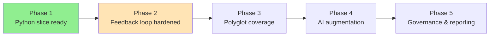

# Implementation Roadmap

The roadmap provides a pragmatic sequence for delivering Emperator, starting with a focused Python slice and expanding once the core pipeline proves reliable. This document tracks progress and links to detailed sprint planning.

**Legend:**

- 🟢 Green: Completed
- 🟡 Yellow: In Progress / Planned
- ⚪ White: Future Work

## Progress Overview

| Phase                            | Status         | Completion | Key Milestones                                                  |
| -------------------------------- | -------------- | ---------- | --------------------------------------------------------------- |
| Phase 1: Python-focused slice    | 🟢 In Progress | 70%        | Contract, CLI, Analysis foundation complete; IR builder planned |
| Phase 2: Developer feedback loop | 🟡 Planned     | 0%         | Sprint 4-5 detailed plans created                               |
| Phase 3: Polyglot expansion      | ⚪ Future      | 0%         | Depends on Phase 2 completion                                   |
| Phase 4: AI augmentation         | ⚪ Future      | 0%         | Safety envelope must be proven first                            |
| Phase 5: Governance & reporting  | ⚪ Future      | 0%         | Operational readiness focus                                     |

## Phase 1: Python-focused slice

**Status:** 🟢 70% Complete (In Progress)\
**Timeline:** Sprint 1-3 (Completed) + Sprint 4 (In Progress)

**Completed (Sprint 1-3):**

✅ **Contract Foundation:**

- Contract validation CLI with strict mode (`emperator contract validate`)
- CUE-based conventions support
- OpenAPI spec integration for API scaffolding
- Rego policy framework

✅ **CLI & Developer Tools:**

- Comprehensive CLI with Typer (`emperator`)
- Scaffold commands (`scaffold audit`, `scaffold ensure`)
- Doctor diagnostics (`doctor env`)
- Analysis planning (`analysis plan`, `analysis inspect`)
- Analysis execution (`analysis run`)
- Rich progress reporting and telemetry

✅ **Telemetry Infrastructure:**

- JSONL-backed telemetry store
- Fingerprinting for analysis runs
- Severity filtering and metadata capture
- Atomic writes with corruption handling

✅ **Quality Infrastructure:**

- 100% test coverage (118 tests passing)
- Ruff `ALL` lint configuration
- Mypy type checking
- Pre-commit hooks and CI integration
- SARIF output for security findings

**In Progress (Sprint 4 – IR & Analysis Integration):**

🟡 **IR Construction (Planned):**

- Tree-sitter based parser for Python
- Incremental parsing with filesystem cache
- Symbol extraction (functions, classes, imports)
- Cache management (`emperator ir cache prune`)
- Performance: ≤5s per 1000 files (target)

🟡 **Analysis Integration (Planned):**

- Semgrep rule generation from contract conventions
- CodeQL database pipeline with queries
- Findings-to-contract correlation engine
- Remediation guidance extraction
- Performance benchmarking framework

**References:**

- [Sprint 4 Detailed Plan](sprint-4-ir-analysis.md)
- [ADR-0004: IR Builder Architecture](../adr/0004-ir-builder-architecture.md)
- [Sprint 4 Playbook Tasks](../../Next_Steps.md#sprint-4--ir--analysis-integration)

## Phase 2: Developer feedback loop

**Status:** 🟡 Planned\
**Timeline:** Sprint 5 (Planned) + Sprint 6 (Future)

**Sprint 5 – Automated Fix & Safety Envelope (Planned):**

🟡 **Fix Engine Foundation:**

- LibCST integration for Python AST transformations
- Four-tier risk classification (0-3: Formatting → Architectural)
- Transformer catalog (Rename, DeprecatedAPI, TypeAnnotation, etc.)
- OpenRewrite integration for Java/Kotlin (future)

🟡 **Safety Validation:**

- Multi-layer validation pipeline (pre/post checks)
- Static analysis integration (Ruff, Mypy)
- Test execution with tier-based selection
- Diff scope verification

🟡 **Rollback & Approval:**

- Rollback manager (snapshot, git stash, commit/revert)
- Interactive approval workflow for Tier 2+ fixes
- Batch approval for Tier 0-1 automation
- Provenance metadata in commit messages
- Audit trail telemetry

🟡 **Property-Based Testing:**

- Hypothesis integration for transformation verification
- Idempotence, syntax preservation, test preservation properties
- Semantic equivalence checks for pure functions

**Sprint 6 – Production Hardening (Future):**

⚪ Pilot with real teams to gather usability data
⚪ Measure runtime and identify noisy rules
⚪ Harden pre-commit and CI integrations
⚪ SARIF uploads and provenance artifact capture
⚪ Expand documentation based on pilot feedback
⚪ Waiver workflows and troubleshooting guides

**References:**

- [Sprint 5 Detailed Plan](sprint-5-safety-envelope.md)
- [ADR-0005: Safety Envelope Design](../adr/0005-safety-envelope-design.md)
- [Sprint 5 Playbook Tasks](../../Next_Steps.md#sprint-5--automated-fix--safety-envelope)
- [Safety & Security Explanation](security-safety.md)

## Phase 3: Polyglot expansion

**Status:** ⚪ Future\
**Dependencies:** Phase 2 completion, proven safety envelope

⚪ **Multi-Language Support:**

- Add Java/Kotlin OpenRewrite support (Sprint 5 foundation)
- JavaScript/TypeScript with ESLint/TypeScript AST
- Go, C/C++, Rust Tree-sitter grammars
- Language-specific symbol extraction

⚪ **Rule Pack Expansion:**

- Broaden Semgrep rules across languages
- CodeQL security queries per language
- Organization-specific security checks
- Framework-specific patterns (React, Spring, etc.)

⚪ **LSP Enhancement:**

- Richer in-editor diagnostics
- Quick fixes in IDE
- Real-time contract validation
- Symbol navigation across languages

**Estimated Timeline:** 8-12 weeks after Phase 2 completion

**References:**

- [System Architecture](system-architecture.md) – Polyglot IR design
- [Toolchain Reference](../reference/toolchain.md) – Language tooling matrix

## Phase 4: AI augmentation

**Status:** ⚪ Future\
**Dependencies:** Phase 3 completion, safety envelope proven at scale

⚪ **Local LLM Integration:**

- Optional local LLM assistance (Code Llama, StarCoder)
- Propose → Rank → Validate loop for complex migrations
- Context-aware fix suggestions
- Natural language explanations

⚪ **AI-Assisted Workflows:**

- Complex deprecation upgrades (e.g., Python 2 to 3)
- Documentation generation from code
- Test case generation
- Code review comments

⚪ **Safety & Governance:**

- All AI outputs validated by static analysis
- Clear provenance marking (model name, version)
- Opt-in model usage (privacy-first)
- Fine-tuning on organization patterns (optional)

⚪ **Success Metrics:**

- Proportion of Tier 3 issues resolvable with AI assistance
- Review acceptance rate for AI suggestions
- False positive rate (target: ≤5%)
- Graduate successful patterns to deterministic codemods

**Estimated Timeline:** 12-16 weeks after Phase 3 completion

**References:**

- [AI Orchestration Explanation](ai-orchestration.md) – Propose-Rank-Validate loop
- [Security & Safety](security-safety.md) – AI output validation

## Phase 5: Reporting and governance

**Status:** ⚪ Future\
**Dependencies:** Phase 4 completion, production adoption proven

⚪ **Dashboards & Reporting:**

- Contract compliance trend dashboards
- SBOM status and dependency tracking
- Waiver aging and exemption reporting
- Fix success rate analytics
- Performance metrics over time

⚪ **Governance Integration:**

- Risk management system integration
- Exemption workflows with approvals
- Mitigation plan tracking
- Compliance evidence packs for audits

⚪ **Release Engineering:**

- Signed attestations (SLSA provenance)
- Automated changelog generation
- SBOM generation (CycloneDX/SPDX)
- Comprehensive evidence packages
- Version management and deprecation tracking

⚪ **Operational Excellence:**

- Incident response playbooks
- On-call runbooks
- Performance monitoring
- Usage analytics and adoption metrics

**Estimated Timeline:** 8-12 weeks after Phase 4 completion

**References:**

- [Governance Reference](../reference/governance.md)
- [DevSecOps Supply Chain](devsecops-supply-chain.md)

______________________________________________________________________

## Implementation Notes

This phased approach keeps risk low, builds trust through incremental wins, and ensures each capability ships with the necessary documentation, automation, and validation. Each phase builds on the previous, with clear success criteria and exit gates.

**Current Focus:** Sprint 4 (IR & Analysis Integration) – detailed planning complete, implementation starting.

**Next Milestone:** Sprint 5 (Safety Envelope) – comprehensive design documented, awaiting Sprint 4 completion.
