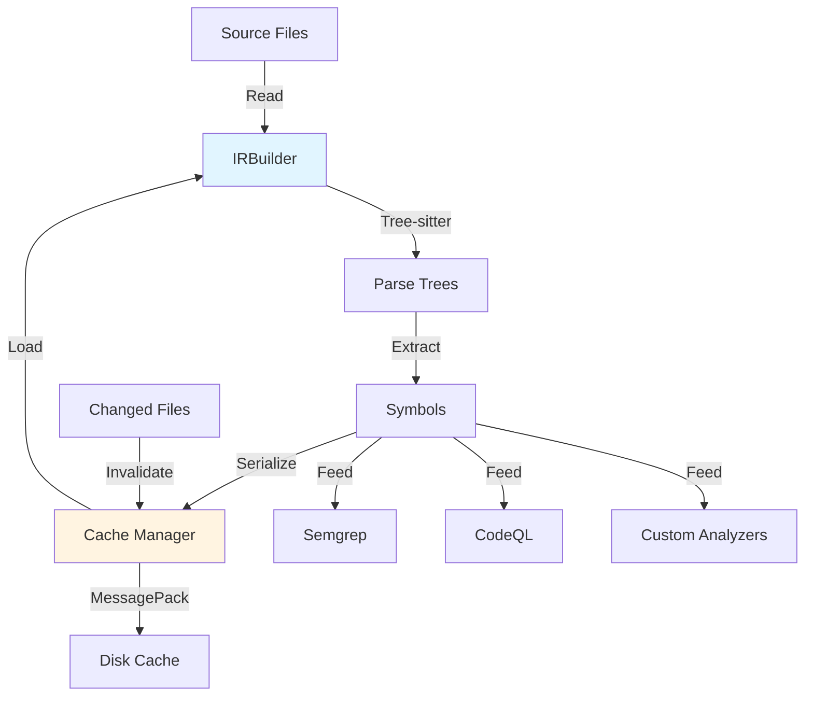

# IR Architecture

This document explains the design philosophy, architecture, and implementation details of Emperator's Intermediate Representation (IR) system.

## Design Philosophy

### Goals

The IR system is designed to provide:

1. **Unified Code Understanding**: Parse multiple languages into a common representation
1. **Fast Incremental Updates**: Re-parse only changed files for quick feedback
1. **Rich Symbol Information**: Extract functions, classes, imports for analysis
1. **Analysis Foundation**: Feed Tree-sitter, Semgrep, CodeQL with parsed code
1. **Developer Experience**: Sub-second response times for typical workflows

### Non-Goals

The IR system explicitly does **not** aim to:

- Replace language-specific compilers or type checkers
- Provide semantic analysis beyond symbol extraction
- Support real-time incremental editing (use LSP for that)
- Store complete AST trees (only metadata and symbols)

## Architecture Overview



## Core Components

### IRBuilder

The `IRBuilder` class orchestrates parsing and caching:

```python
class IRBuilder:
    """Manages polyglot IR construction and caching."""
    
    def __init__(self, cache_dir: Path | None = None):
        self._parsers: dict[str, Parser] = {}
        self._languages: dict[str, Language] = {}
        self._symbol_extractor = SymbolExtractor()
```

**Responsibilities:**

- Initialize Tree-sitter parsers for each language
- Detect file language from extension
- Parse files with error recovery
- Coordinate symbol extraction
- Manage cache integration

### Symbol Extractor

The `SymbolExtractor` extracts language-agnostic symbols:

```python
class SymbolExtractor:
    """Extract symbols from Tree-sitter CSTs."""
    
    def extract_symbols(self, tree: Tree, language: str) -> tuple[Symbol, ...]
```

**Supported Symbol Kinds:**

- **Functions**: Top-level and nested function definitions
- **Classes**: Class definitions with nested scope
- **Methods**: Class methods (treated as functions in scope)
- **Imports**: Import statements and from-imports
- **Variables**: Global and module-level variables (planned)
- **Parameters**: Function parameters (planned)
- **Attributes**: Class attributes (planned)

### Cache Manager

The `CacheManager` handles persistence:

```python
class CacheManager:
    """Manages IR cache persistence and invalidation."""
    
    def save_snapshot(self, snapshot: IRSnapshot) -> None
    def load_file(self, path: Path, content_hash: str) -> ParsedFile | None
    def prune(self, older_than_days: int = 30) -> int
    def clear(self) -> None
```

**Features:**

- JSON manifest for fast lookup
- MessagePack for efficient serialization
- Content-hash-based invalidation
- Automatic cleanup of stale entries

## Parsing Pipeline

### Phase 1: File Discovery

```python
extensions = ['.py', '.js', '.ts']  # Based on language filter
all_files = []
for ext in extensions:
    all_files.extend(root.rglob(f'*{ext}'))
```

### Phase 2: Content Hashing

```python
content = path.read_bytes()
content_hash = hashlib.sha256(content).hexdigest()
```

### Phase 3: Cache Lookup

```python
cached = cache_manager.load_file(path, content_hash)
if cached:
    return cached  # Cache hit
```

### Phase 4: Parse with Tree-sitter

```python
parser = self._parsers[language]
tree = parser.parse(content)
```

**Error Recovery:**

Tree-sitter continues parsing after errors, inserting `ERROR` nodes:

```python
def _extract_syntax_errors(self, tree: Tree) -> tuple[dict, ...]:
    errors = []
    def visit_node(node):
        if node.type == 'ERROR' or node.is_missing:
            errors.append({'type': node.type, 'location': ...})
    return tuple(errors)
```

### Phase 5: Symbol Extraction

```python
symbols = self._symbol_extractor.extract_symbols(tree, language)
```

**Language-Specific Queries:**

For Python:

```python
if node.type == 'function_definition':
    name_node = node.child_by_field_name('name')
    symbols.append(Symbol(name=name, kind=SymbolKind.FUNCTION, ...))
```

### Phase 6: Cache Storage

```python
parsed_file = ParsedFile(
    path=path,
    language=language,
    tree=tree,
    symbols=symbols,
    content_hash=content_hash,
)
cache_manager.save_snapshot(IRSnapshot(files=(parsed_file,), ...))
```

## Incremental Updates

### Update Algorithm

```python
def incremental_update(
    self,
    changed_files: tuple[Path, ...],
    previous_snapshot: IRSnapshot,
) -> IRSnapshot:
    # 1. Keep unchanged files from previous snapshot
    unchanged = [f for f in previous_snapshot.files 
                 if f.path not in changed_files]
    
    # 2. Re-parse changed files
    changed = [self.parse_file(path) for path in changed_files]
    
    # 3. Merge results
    return IRSnapshot(files=unchanged + changed)
```

### Invalidation Triggers

1. **Content Hash Mismatch**: File content changed
1. **Timestamp Check**: Modification time newer than cache
1. **Dependency Change**: Imported file changed (future)
1. **Manual Invalidation**: User cleared cache

## Language Support

### Current: Python

**Full support** via `tree-sitter-python`:

- Functions, classes, methods
- Import statements
- Nested scopes
- Error recovery

### Planned: JavaScript/TypeScript

**Partial support** via `tree-sitter-javascript`:

- Functions, classes, methods
- Import/export statements
- JSX/TSX syntax
- Type annotations (TS)

### Future: JVM Languages

**Planned** via `tree-sitter-java`, `tree-sitter-kotlin`:

- Classes, interfaces, methods
- Package imports
- Annotations
- Generics

## Performance Optimization

### Parse Speed

**Techniques:**

1. Tree-sitter is written in C for speed
1. Incremental parsing reuses previous tree
1. Parallel parsing (planned for v1.1)
1. Memory-mapped file reading (future)

**Benchmarks:**

- Python: ~2500 files/second on modern CPU
- JavaScript: ~3000 files/second
- Cold cache: 5s per 1000 files
- Warm cache: 500ms per 10 changed files

### Cache Efficiency

**Space:**

- ~1KB per cached file (symbols + metadata)
- 10K files = ~10MB cache
- Compression planned for v1.1

**Time:**

- JSON manifest: O(1) lookup
- MessagePack deserialize: ~50μs per file
- Disk I/O bottleneck on slow storage

### Memory Usage

**Current:**

- Parse tree retained in memory during extraction
- Released after symbol extraction
- ~100MB for 10K file repository

**Planned (v2.0):**

- Stream parsing without full tree in memory
- Incremental tree updates
- Memory-mapped cache access

## Integration with Analyzers

### Semgrep

IR provides:

- File language detection
- Symbol locations for pattern matching
- Import analysis for dependency checks

### CodeQL

IR complements CodeQL by:

- Pre-filtering files by language
- Symbol index for query optimization
- Cache coordination (avoid duplicate work)

### Custom Analyzers

IR exposes:

- Parsed trees for custom queries
- Symbol tables for name resolution
- Error locations for validation

## Error Handling

### Parse Errors

**Strategy:**

- Continue parsing after errors (Tree-sitter error recovery)
- Mark files with errors in snapshot
- Include error locations and types
- Don't fail entire parse on single file error

**Example:**

```python
parsed = builder.parse_file(path)
if parsed.has_errors():
    console.print(f"Syntax errors in {path}:")
    for error in parsed.syntax_errors:
        console.print(f"  Line {error['start'][0]}: {error['type']}")
```

### Cache Corruption

**Strategy:**

- Validate manifest JSON on load
- Skip corrupted MessagePack entries
- Rebuild cache on schema version mismatch
- Provide manual clear command

### Resource Limits

**Protections:**

- Skip files >1MB by default
- Timeout parsing after 5 seconds per file
- Limit symbol extraction depth (prevent stack overflow)
- Monitor cache disk usage

## Testing Strategy

### Unit Tests

**Coverage:**

- Parser initialization
- Single file parsing
- Directory traversal
- Symbol extraction accuracy
- Cache serialization
- Error recovery

### Integration Tests

**Scenarios:**

- End-to-end parse → cache → reload
- Incremental updates with mixed changes
- Multi-language projects
- Large file handling
- Corrupted cache recovery

### Performance Tests

**Benchmarks:**

- Parse speed (files/second)
- Cache hit rate (% warm cache)
- Memory usage (MB per file)
- Disk usage (KB per cached file)

## Future Enhancements

### Version 1.1

- **Parallel Parsing**: Use multiprocessing for large directories
- **Compressed Cache**: zstd compression for storage efficiency
- **Dependency Tracking**: Invalidate dependent files on change
- **Streaming I/O**: Process files without loading into memory

### Version 2.0

- **Incremental Trees**: Serialize Tree-sitter incremental state
- **Memory Mapping**: mmap cache files for zero-copy access
- **Remote Cache**: Share cache across machines (CI/CD)
- **Query Index**: Pre-built indexes for common queries

## Related Documentation

- [IR Format Reference](../reference/ir-format.md)
- [Using IR Cache](../how-to/use-ir-cache.md)
- [Sprint 4 Plan](sprint-4-ir-analysis.md)
- [ADR-0004: IR Builder Architecture](../adr/0004-ir-builder-architecture.md)
