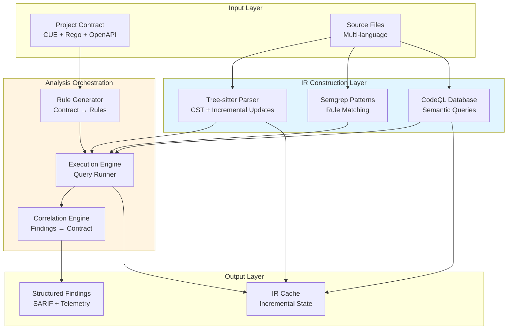

# Sprint 4: IR & Analysis Integration – Detailed Planning

## Executive Summary

Sprint 4 delivers the foundational IR (Intermediate Representation) pipeline and analysis orchestration that enables Emperator to understand code across multiple languages uniformly. This sprint bridges the gap between contract definitions and actionable enforcement by building the polyglot code understanding layer.

**Key Outcomes:**

- Operational Tree-sitter based IR builder with incremental update support
- Semgrep rule pack generation from contract conventions
- CodeQL database pipeline with caching and query execution
- Findings-to-contract correlation engine
- Performance benchmarks establishing baseline metrics for production readiness

## Strategic Context

### Alignment with Master Plan

Sprint 4 implements Phase 2–3 capabilities from `emperator_specs/Emperator_Master.md`:

- Universal Code IR construction (Tree-sitter CST + CodeQL semantic DB + Semgrep patterns)
- Check engines running queries and pattern rules on the IR
- Evidence-gated protocol through analysis triangulation
- Foundation for deterministic automation in Sprint 5

### Dependencies and Prerequisites

**Completed (Sprint 1–3):**

- Contract validation CLI with strict mode
- Analysis planning and inspection workflows
- Telemetry infrastructure with JSONL persistence
- Doctor diagnostics for tool availability
- CLI foundations with Rich progress reporting

**Required External Tools:**

- Tree-sitter CLI and language grammars
- Semgrep OSS (installed via `pip` or system package)
- CodeQL CLI (available from GitHub releases)
- Language-specific toolchains for parsing context

## Architecture Overview



## Detailed Work Breakdown

### 1. IR Builder Foundation

**Objective:** Implement Tree-sitter based parser service with incremental update support.

**Key Components:**

#### 1.1 Parser Service (`src/emperator/ir/parser.py`)

```python
@dataclass
class ParsedFile:
    """Represents a single file's parse state."""
    path: Path
    language: str
    tree: Tree  # Tree-sitter CST
    syntax_errors: tuple[SyntaxError, ...]
    symbols: tuple[Symbol, ...]
    last_modified: float
    content_hash: str

class IRBuilder:
    """Manages polyglot IR construction and caching."""
    
    def parse_file(self, path: Path) -> ParsedFile:
        """Parse single file into CST with error recovery."""
        
    def parse_directory(self, root: Path, languages: tuple[str, ...]) -> IRSnapshot:
        """Batch parse with progress reporting."""
        
    def incremental_update(self, changed_files: tuple[Path, ...]) -> IRDelta:
        """Re-parse only modified files and dependents."""
        
    def get_cache_key(self, file_content: str) -> str:
        """Deterministic hash for cache lookup."""
```

**Implementation Notes:**

- Use existing `_LANGUAGE_MAP` from `src/emperator/analysis.py` for extension detection
- Integrate with Tree-sitter's error recovery to handle incomplete code
- Store parse trees in `.emperator/ir-cache/` with versioned schema
- Track file dependencies for incremental invalidation
- Emit telemetry events for parse time and cache hit rates

#### 1.2 Symbol Extraction (`src/emperator/ir/symbols.py`)

```python
@dataclass
class Symbol:
    """Language-agnostic symbol representation."""
    name: str
    kind: SymbolKind  # function, class, variable, import, etc.
    location: Location
    scope: str
    references: tuple[Location, ...]
    metadata: dict[str, Any]

class SymbolExtractor:
    """Extract symbols from Tree-sitter CSTs."""
    
    def extract_symbols(self, tree: Tree, language: str) -> tuple[Symbol, ...]:
        """Use language-specific queries to find symbols."""
```

**Language Priority:**

1. Python (immediate)
1. JavaScript/TypeScript (Sprint 4.5)
1. Java, Go, C/C++ (Phase 3)

#### 1.3 Cache Strategy

**Location:** `.emperator/ir-cache/`

**Structure:**

```
.emperator/ir-cache/
├── manifest.json          # Cache version, schema, stats
├── files/
│   ├── <content-hash>.cst     # Serialized Tree-sitter tree
│   └── <content-hash>.symbols # Symbol table
└── dependencies.graph      # File dependency map for invalidation
```

**Cache Invalidation:**

- Content hash comparison (SHA-256 of normalized source)
- Timestamp fallback for rapid iteration
- Dependency tracking for transitive updates
- CLI command: `emperator ir cache prune --older-than 30d`

**Performance Targets:**

- Initial parse: ≤5s per 1000 files
- Incremental update: ≤500ms for 10 changed files
- Cache hit rate: ≥90% in typical dev workflows
- Memory footprint: ≤100MB for 10k file repository

### 2. Semgrep Rule Translation

**Objective:** Generate Semgrep rule packs from contract conventions and policies.

#### 2.1 Rule Generator (`src/emperator/rules/semgrep_gen.py`)

```python
@dataclass
class SemgrepRule:
    """Semgrep YAML rule definition."""
    id: str
    message: str
    severity: Severity
    pattern: str | dict
    languages: tuple[str, ...]
    metadata: dict[str, Any]
    fix: str | None = None

class SemgrepRuleGenerator:
    """Compile contract conventions into Semgrep rules."""
    
    def generate_from_convention(self, convention: CUEConvention) -> tuple[SemgrepRule, ...]:
        """Map CUE naming/structure rules to Semgrep patterns."""
        
    def generate_from_policy(self, policy: RegoPolicy) -> tuple[SemgrepRule, ...]:
        """Extract pattern-matchable checks from Rego."""
        
    def write_rule_pack(self, rules: tuple[SemgrepRule, ...], output: Path) -> None:
        """Serialize to Semgrep YAML format."""
```

**Rule Categories:**

1. **Naming Conventions:** Extract from `contract/conventions.cue`

   - `snake_case` for Python functions
   - `PascalCase` for classes
   - Module path structure

1. **Security Patterns:** From `contract/policy/*.rego`

   - Banned function calls (e.g., `eval`, `exec`)
   - SQL injection patterns
   - Hardcoded secrets

1. **Architectural Rules:** Layering violations

   - Controller → Service → Repository
   - Import restrictions by module

**Storage:** `contract/generated/semgrep/`

**Integration Point:** `emperator analysis run` executes generated rules

#### 2.2 Documentation Integration

Update `docs/how-to/author-contract.md`:

````markdown
## Semgrep Rule Generation

When you add a naming convention in `contract/conventions.cue`:

```cue
naming: {
    functions: {
        pattern: "^[a-z_][a-z0-9_]*$"
        message: "Function names must use snake_case"
    }
}
````

Emperator automatically generates a Semgrep rule:

```yaml
rules:
  - id: naming-function-snake-case
    pattern: |
      def $FUNC(...):
          ...
    languages: [python]
    message: Function names must use snake_case
    severity: WARNING
    metadata:
      source: contract/conventions.cue#naming.functions
```

Regenerate rules with: `emperator contract compile --rules`

````

### 3. CodeQL Database Pipeline

**Objective:** Generate and query CodeQL databases for semantic analysis.

#### 3.1 Database Generation (`src/emperator/analysis/codeql.py`)

```python
@dataclass
class CodeQLDatabase:
    """Represents a CodeQL database for a language."""
    language: str
    path: Path
    source_root: Path
    created_at: datetime
    size_bytes: int

class CodeQLManager:
    """Orchestrate CodeQL database lifecycle."""
    
    async def create_database(
        self,
        source_root: Path,
        language: str,
        output: Path,
    ) -> CodeQLDatabase:
        """Generate CodeQL database with progress tracking."""
        
    async def run_queries(
        self,
        database: CodeQLDatabase,
        queries: tuple[Path, ...],
    ) -> tuple[CodeQLFinding, ...]:
        """Execute queries and parse SARIF results."""
        
    def cache_database(self, db: CodeQLDatabase) -> None:
        """Store database in .emperator/codeql-cache/."""
        
    def invalidate_cache(self, source_root: Path, language: str) -> None:
        """Remove cached database when source changes significantly."""
````

**CLI Integration:**

```bash
# Generate database for current project
emperator analysis codeql create --language python

# Run custom queries
emperator analysis codeql query \
    --database .emperator/codeql-cache/python \
    --query rules/codeql/security-queries.ql

# List available databases
emperator analysis codeql list
```

#### 3.2 Query Library

**Location:** `rules/codeql/`

**Query Categories:**

1. **Security:** `security-queries.ql`

   - SQL injection detection
   - Path traversal
   - Command injection

1. **Dataflow:** `dataflow-queries.ql`

   - Untrusted data flow to sinks
   - Sensitive data exposure

1. **Architecture:** `architecture-queries.ql`

   - Layer boundary violations
   - Circular dependencies

**Query Development Workflow:**

1. Write query in QL language
1. Test against sample vulnerable code
1. Validate findings match expectations
1. Document query rationale and remediation
1. Add to contract-driven query pack

#### 3.3 Cache Strategy

**Location:** `.emperator/codeql-cache/`

**Cache Key:** `{language}-{source-hash-prefix}`

**Invalidation Triggers:**

- > 10% of files modified since last database creation
- Language toolchain version change
- Explicit `--refresh` flag

**Disk Space Management:**

- Default retention: 30 days
- Prune command: `emperator analysis codeql prune`
- Warn when cache exceeds 5GB

### 4. Findings-to-Contract Correlation

**Objective:** Link analysis findings back to contract clauses for traceability.

#### 4.1 Correlation Engine (`src/emperator/analysis/correlation.py`)

```python
@dataclass
class CorrelatedFinding:
    """Finding linked to contract source."""
    finding: AnalysisFinding
    contract_rule: ContractRule
    correlation_confidence: float
    remediation_guidance: str
    exemption_status: ExemptionStatus | None

class CorrelationEngine:
    """Map findings to contract rules."""
    
    def correlate(
        self,
        findings: tuple[AnalysisFinding, ...],
        contract: Contract,
    ) -> tuple[CorrelatedFinding, ...]:
        """Match findings to contract rules by ID and metadata."""
        
    def suggest_remediation(
        self,
        finding: CorrelatedFinding,
    ) -> RemediationPlan:
        """Propose fix based on contract guidance."""
```

**Correlation Strategy:**

1. **Direct ID Match:** Finding rule ID matches contract rule ID
1. **Metadata Match:** Tags, categories align with contract sections
1. **Pattern Match:** Finding pattern similar to contract rule pattern
1. **Fallback:** Generic remediation based on severity

**Output Format:**

```json
{
  "finding": {
    "id": "security.ban-eval",
    "location": "src/util.py:42",
    "message": "Use of eval() is forbidden"
  },
  "contract_rule": {
    "id": "security.banned-functions.eval",
    "source": "contract/policy/security.rego:15",
    "severity": "high",
    "remediation": "Replace eval() with ast.literal_eval() or json.loads()"
  },
  "confidence": 1.0,
  "exemption": null
}
```

#### 4.2 Remediation Guidance

Extract remediation from contract metadata:

```rego
package security

deny[finding] {
    contains(input.code, "eval(")
    finding := {
        "id": "security.ban-eval",
        "severity": "high",
        "message": "Use of eval() is forbidden",
        "remediation": {
            "description": "Replace eval() with safer alternatives",
            "suggestions": [
                "Use ast.literal_eval() for Python literals",
                "Use json.loads() for JSON strings",
                "Refactor to avoid dynamic code execution"
            ],
            "references": [
                "https://owasp.org/www-community/vulnerabilities/Code_Injection",
                "docs/explanation/security-safety.md#banned-functions"
            ]
        }
    }
}
```

### 5. Performance Benchmarking Framework

**Objective:** Establish baseline metrics and acceptance thresholds.

#### 5.1 Benchmark Scenarios

**Repository Profiles:**

1. **Small:** 100 files, 10k LOC
1. **Medium:** 1000 files, 100k LOC
1. **Large:** 10k files, 1M LOC

**Measured Operations:**

- Initial IR parse (cold cache)
- Incremental IR update (warm cache)
- Semgrep rule execution
- CodeQL database creation
- CodeQL query execution
- Correlation processing

#### 5.2 Benchmark Implementation (`tests/benchmarks/test_ir_performance.py`)

```python
@pytest.mark.benchmark
def test_ir_parse_cold_cache_small_repo(benchmark, small_repo):
    """Baseline: parse 100 Python files from scratch."""
    builder = IRBuilder()
    result = benchmark(builder.parse_directory, small_repo, languages=('python',))
    assert result.parse_time_seconds < 5.0

@pytest.mark.benchmark
def test_ir_incremental_update_10_files(benchmark, medium_repo_with_cache):
    """Incremental: update 10 changed files."""
    builder = IRBuilder(cache_dir=medium_repo_with_cache.cache)
    changed = sample_files(medium_repo_with_cache, count=10)
    result = benchmark(builder.incremental_update, changed)
    assert result.update_time_seconds < 0.5

@pytest.mark.benchmark
def test_semgrep_execution_contract_rules(benchmark, medium_repo):
    """Semgrep: run generated contract rules."""
    rules = generate_contract_rules(medium_repo.contract)
    result = benchmark(run_semgrep, medium_repo.source, rules)
    assert result.execution_time_seconds < 30.0
```

#### 5.3 Acceptance Thresholds

**Sprint 4 Demo Targets:**

| Metric                        | Small Repo | Medium Repo | Large Repo |
| ----------------------------- | ---------- | ----------- | ---------- |
| Initial IR Parse              | ≤5s        | ≤30s        | ≤5min      |
| Incremental Update (10 files) | ≤200ms     | ≤500ms      | ≤1s        |
| Semgrep Execution             | ≤10s       | ≤30s        | ≤2min      |
| CodeQL DB Creation            | ≤30s       | ≤5min       | ≤20min     |
| CodeQL Query (single)         | ≤5s        | ≤15s        | ≤1min      |
| Full Analysis Run             | ≤1min      | ≤5min       | ≤20min     |

**Quality Gates:**

- ✅ Pass: All thresholds met
- ⚠️ Review: 1–2 metrics exceed by ≤20%
- ❌ Block: Any metric exceeds by >20%

#### 5.4 Continuous Monitoring

**Integration:**

- Run benchmarks in CI on representative repos
- Track metrics over time in telemetry
- Alert on regression >10% between commits
- Dashboard: `docs/metrics/performance.md` (auto-generated)

## Implementation Sequence

### Week 1: IR Foundation (T+0 to T+5 days)

**Tasks:**

- [ ] Implement `IRBuilder` with Tree-sitter integration
- [ ] Add Python symbol extraction
- [ ] Create cache schema and persistence layer
- [ ] Write unit tests for parser service
- [ ] Document IR cache format in `docs/reference/ir-format.md`

**Deliverables:**

- `src/emperator/ir/parser.py` with 100% coverage
- CLI command: `emperator ir parse --language python`
- Cache stored in `.emperator/ir-cache/`

**Success Criteria:**

- Parse 100 Python files in ≤5s
- Cache hit rate ≥90% on second run
- Zero parse failures on valid Python

### Week 2: Semgrep Integration (T+5 to T+10 days)

**Tasks:**

- [ ] Implement Semgrep rule generator
- [ ] Map CUE conventions to patterns
- [ ] Extract security rules from Rego
- [ ] Generate rule packs in `contract/generated/`
- [ ] Integrate with `analysis run` command
- [ ] Add rule validation tests

**Deliverables:**

- `src/emperator/rules/semgrep_gen.py`
- Generated rules in YAML format
- Updated `docs/how-to/author-contract.md`

**Success Criteria:**

- Generate ≥20 rules from sample contract
- All rules validate with `semgrep --validate`
- Rules detect known violations in test code

### Week 3: CodeQL Pipeline (T+10 to T+15 days)

**Tasks:**

- [ ] Implement CodeQL database manager
- [ ] Add CLI commands for DB lifecycle
- [ ] Create query library for security checks
- [ ] Integrate with telemetry system
- [ ] Document query development workflow
- [ ] Add cache management commands

**Deliverables:**

- `src/emperator/analysis/codeql.py`
- Query library in `rules/codeql/`
- CLI: `emperator analysis codeql create/query/list/prune`

**Success Criteria:**

- Create Python database in ≤30s for 1k files
- Execute security queries successfully
- Cache persists between runs

### Week 4: Correlation & Benchmarks (T+15 to T+20 days)

**Tasks:**

- [ ] Implement correlation engine
- [ ] Add remediation guidance extraction
- [ ] Create benchmark suite
- [ ] Run performance tests
- [ ] Document correlation algorithm
- [ ] Generate performance baseline report

**Deliverables:**

- `src/emperator/analysis/correlation.py`
- Benchmark suite in `tests/benchmarks/`
- Performance report in `docs/metrics/sprint-4-baseline.md`

**Success Criteria:**

- Correlation accuracy ≥95% on test cases
- All benchmark thresholds met
- Documentation complete

## Testing Strategy

### Unit Tests

**Coverage Target:** ≥95% for new modules

**Key Test Areas:**

- IR parser with various Python constructs
- Symbol extraction accuracy
- Cache hit/miss scenarios
- Rule generation correctness
- CodeQL invocation and parsing
- Correlation matching logic

### Integration Tests

**Scenarios:**

1. **End-to-End Analysis:**

   - Parse → Generate Rules → Execute → Correlate
   - Verify SARIF output matches expectations

1. **Cache Invalidation:**

   - Modify file → Parse → Verify cache miss
   - Revert file → Parse → Verify cache hit

1. **Multi-Language:**

   - Mixed Python/JavaScript repo
   - Verify language-specific rules apply correctly

### Performance Tests

**Framework:** `pytest-benchmark`

**Execution:** Separate CI job with larger runners

**Reporting:** Auto-generate performance reports

## Documentation Updates

### New Documents

1. **`docs/explanation/ir-architecture.md`**

   - IR design philosophy
   - Parser service internals
   - Cache strategy rationale

1. **`docs/how-to/use-ir-cache.md`**

   - Cache management commands
   - Troubleshooting cache issues
   - Performance tuning

1. **`docs/reference/ir-format.md`**

   - Cache schema specification
   - Versioning strategy
   - Migration guide

1. **`docs/how-to/develop-codeql-queries.md`**

   - Query development workflow
   - Testing queries
   - Integration with contract

### Updated Documents

1. **`docs/reference/toolchain.md`**

   - Add Tree-sitter, CodeQL requirements
   - Update version matrix

1. **`docs/how-to/ci-integration.md`**

   - IR caching in CI
   - Benchmark execution

1. **`docs/cli.md`**

   - New `ir` and `codeql` subcommands
   - Updated `analysis run` behavior

1. **`docs/explanation/system-architecture.md`**

   - IR layer details
   - Analysis pipeline flow

## Risk Register

### Technical Risks

**Risk 1: Tree-sitter Performance on Large Files**

- **Severity:** Medium
- **Mitigation:** Implement file size threshold, chunk large files
- **Contingency:** Fall back to simpler parsing for oversized files

**Risk 2: CodeQL License Constraints**

- **Severity:** Low
- **Mitigation:** Document OSS vs Enterprise requirements clearly
- **Contingency:** Make CodeQL optional, use Semgrep only

**Risk 3: Cache Bloat**

- **Severity:** Low
- **Mitigation:** Implement automatic pruning, size limits
- **Contingency:** Make cache optional with `--no-cache` flag

### Schedule Risks

**Risk 4: CodeQL Integration Complexity**

- **Severity:** Medium
- **Mitigation:** Start integration early, allocate buffer time
- **Contingency:** Defer complex queries to Phase 3

**Risk 5: Cross-Language Symbol Extraction**

- **Severity:** Medium
- **Mitigation:** Focus on Python first, defer others
- **Contingency:** Ship with Python-only support initially

## Success Metrics

### Quantitative

- ✅ All benchmark thresholds met
- ✅ Test coverage ≥95% for new modules
- ✅ Zero P0/P1 bugs in testing phase
- ✅ Performance regression ≤5% vs baseline
- ✅ Cache hit rate ≥90% in dev workflows

### Qualitative

- ✅ IR architecture documented and reviewed
- ✅ Correlation algorithm produces actionable guidance
- ✅ Developer feedback: "IR caching saves time"
- ✅ Contract authors can generate Semgrep rules easily
- ✅ CodeQL queries align with contract policies

## Sprint 4 Demo Plan

**Date:** 2025-10-29

**Duration:** 30 minutes

**Agenda:**

1. **IR Builder Demo (10 min)**

   - Parse sample repo, show progress
   - Demonstrate cache hit on re-run
   - Display symbol extraction output

1. **Rule Generation Demo (5 min)**

   - Show contract convention
   - Generate Semgrep rules
   - Execute rules and show findings

1. **CodeQL Integration Demo (5 min)**

   - Create database
   - Run security queries
   - Show SARIF output

1. **Correlation Demo (5 min)**

   - Display correlated findings
   - Show remediation guidance
   - Demo exemption flow

1. **Performance Benchmarks (5 min)**

   - Present baseline metrics
   - Compare against targets
   - Discuss optimization opportunities

**Artifacts:**

- Demo repo: `examples/sprint-4-demo/`
- Slides: `docs/presentations/sprint-4-demo.pdf`
- Recording: Archive for async review

## Next Steps (Sprint 5 Preview)

With IR and analysis in place, Sprint 5 will:

- Build fix engines on top of IR (LibCST, OpenRewrite)
- Implement safety envelope with rollback validation
- Add property-based testing for transformations
- Create automated fix approval workflows
- Enhance telemetry with fix outcome tracking

Sprint 4 lays the foundation for deterministic, safe automation.

## References

- [Project Plan](../../emperator_specs/Project_Plan.md)
- [Sprint Playbook](../../emperator_specs/Sprint_Playbook.md)
- [System Architecture](system-architecture.md)
- [Toolchain Reference](../reference/toolchain.md)
- [Contract Specification](../reference/contract-spec.md)
- [ADR-0003: Analyzer Telemetry Architecture](../adr/0003-analyzer-telemetry-architecture.md)
