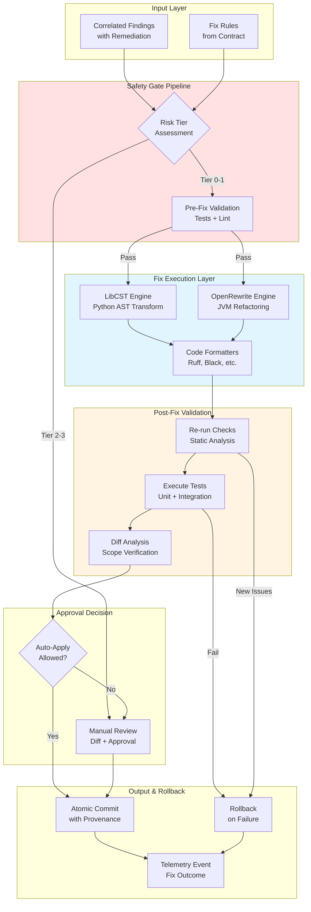

# Sprint 5: Automated Fix & Safety Envelope – Detailed Planning

## Executive Summary

Sprint 5 delivers the safety-critical automation layer that enables Emperator to not just detect violations but automatically remediate them with confidence. This sprint implements the deterministic codemod execution pipeline with comprehensive validation safeguards, rollback mechanisms, and audit trails.

**Key Outcomes:**

- LibCST and OpenRewrite integration for Python and JVM transformations
- Multi-tier safety validation pipeline (static analysis, tests, rollback)
- Property-based and contract-level regression testing framework
- Automated fix approval workflows with confidence scoring
- Safety envelope documentation and operational playbooks

## Strategic Context

### Alignment with Master Plan

Sprint 5 implements Phase 3–4 capabilities from `emperator_specs/Emperator_Master.md`:

- Deterministic codemod execution (LibCST/OpenRewrite)
- Safety gate pipeline with pre/post validation
- Rollback on regression detection
- Risk-tiered automation (Tier 0–3)
- Evidence capture and audit trails

### Dependencies and Prerequisites

**Completed (Sprint 1–4):**

- IR construction with Tree-sitter, Semgrep, CodeQL
- Findings-to-contract correlation engine
- Telemetry infrastructure with event persistence
- Performance benchmarks and baseline metrics
- CLI orchestration with progress reporting

**Required for Sprint 5:**

- Stable IR cache from Sprint 4
- Comprehensive test suite in target repos
- Git integration for atomic commits/rollbacks
- Enhanced telemetry for fix outcome tracking

## Architecture Overview



## Detailed Work Breakdown

### 1. Risk Tier Classification

**Objective:** Categorize fixes by risk level to determine automation boundaries.

#### 1.1 Tier Definitions

**Tier 0: Pure Formatting**

- **Examples:** Whitespace, line length, import sorting
- **Validation:** Formatter output is deterministic
- **Automation:** Auto-apply without review
- **Rollback:** Not needed (no semantic changes)

**Tier 1: Localized Refactors**

- **Examples:** Rename variable, replace deprecated API, type annotation
- **Validation:** Static analysis + unit tests pass
- **Automation:** Auto-apply with test verification
- **Rollback:** Automatic on test failure

**Tier 2: Complex Refactors**

- **Examples:** Extract method, move class, restructure conditionals
- **Validation:** Full test suite + property-based tests
- **Automation:** Suggest with inline diff
- **Rollback:** Manual undo or git revert

**Tier 3: Architectural Changes**

- **Examples:** Split module, change API signature, refactor inheritance
- **Validation:** Integration tests, manual review
- **Automation:** Flag only, no auto-suggestion
- **Rollback:** Manual with migration guide

#### 1.2 Tier Classifier (`src/emperator/fix/classifier.py`)

```python
@dataclass
class FixClassification:
    """Risk assessment for a proposed fix."""
    tier: RiskTier  # 0, 1, 2, 3
    confidence: float
    reasoning: str
    validation_requirements: tuple[ValidationCheck, ...]
    auto_apply_allowed: bool
    requires_manual_review: bool

class RiskClassifier:
    """Classify fixes by risk tier."""

    def classify_fix(
        self,
        finding: CorrelatedFinding,
        proposed_fix: ProposedFix,
        context: CodeContext,
    ) -> FixClassification:
        """Determine risk tier based on fix scope and impact."""

    def assess_impact(self, fix: ProposedFix) -> ImpactAnalysis:
        """Analyze affected files, functions, tests."""

    def recommend_validation(self, classification: FixClassification) -> ValidationPlan:
        """Generate validation checklist for tier."""
```

**Classification Heuristics:**

1. **Lines Changed:** ≤3 → Tier 0-1, >10 → Tier 2-3
1. **Scope:** Single function → Tier 1, Module-wide → Tier 2
1. **Type Changes:** None → Tier 1, Signature changes → Tier 3
1. **Test Coverage:** ≥90% → Lower tier, \<50% → Higher tier
1. **Contract Metadata:** Explicit `auto_apply: true` → Tier 0-1

### 2. LibCST Python Engine

**Objective:** Implement safe AST transformations for Python using LibCST.

#### 2.1 Transformer Registry (`src/emperator/fix/python/transformers.py`)

```python
class EperatorTransformer(cst.CSTTransformer):
    """Base class for Emperator transformations."""

    def __init__(self, context: TransformContext):
        super().__init__()
        self.context = context
        self.changes: list[Change] = []

    def record_change(self, node: cst.CSTNode, description: str) -> None:
        """Log transformation for audit trail."""

class RenameTransformer(EperatorTransformer):
    """Rename identifiers following contract naming rules."""

    def leave_Name(self, original_node: cst.Name, updated_node: cst.Name) -> cst.Name:
        """Apply rename if identifier violates convention."""

class DeprecatedAPITransformer(EperatorTransformer):
    """Replace deprecated function calls."""

    def leave_Call(self, original_node: cst.Call, updated_node: cst.Call) -> cst.Call:
        """Substitute deprecated API with modern equivalent."""

class TypeAnnotationTransformer(EperatorTransformer):
    """Add missing type annotations."""

    def leave_FunctionDef(
        self, original_node: cst.FunctionDef, updated_node: cst.FunctionDef
    ) -> cst.FunctionDef:
        """Infer and add type hints based on usage."""
```

**Transformer Catalog:**

| Transformer                    | Tier | Description                | Contract Source            |
| ------------------------------ | ---- | -------------------------- | -------------------------- |
| `RenameTransformer`            | 1    | Fix naming violations      | `conventions.cue#naming`   |
| `DeprecatedAPITransformer`     | 1    | Replace banned functions   | `policy/security.rego`     |
| `TypeAnnotationTransformer`    | 2    | Add type hints             | `conventions.cue#typing`   |
| `ExtractMethodTransformer`     | 2    | Reduce function complexity | `policy/complexity.rego`   |
| `LayerViolationFixTransformer` | 3    | Fix architectural issues   | `policy/architecture.rego` |

#### 2.2 Transform Execution (`src/emperator/fix/python/engine.py`)

```python
@dataclass
class TransformResult:
    """Outcome of applying transformations."""
    modified_files: tuple[Path, ...]
    changes_applied: int
    syntax_errors: tuple[SyntaxError, ...]
    metadata: dict[str, Any]

class LibCSTEngine:
    """Orchestrate LibCST transformations."""

    def apply_fix(
        self,
        file: Path,
        transformer: EperatorTransformer,
        dry_run: bool = False,
    ) -> TransformResult:
        """Apply single transformer to file."""

    def batch_transform(
        self,
        files: tuple[Path, ...],
        transformers: tuple[EperatorTransformer, ...],
        max_workers: int = 4,
    ) -> TransformResult:
        """Parallel transformation with progress reporting."""

    def verify_syntax(self, file: Path) -> bool:
        """Ensure transformed code is syntactically valid."""
```

**Safety Measures:**

1. **Syntax Preservation:** LibCST maintains formatting and comments
1. **Parse Validation:** Re-parse transformed code before writing
1. **Atomic Updates:** Write to temp file, validate, then replace
1. **Diff Generation:** Produce unified diff for review

#### 2.3 Testing Strategy

**Unit Tests:**

```python
def test_rename_transformer_preserves_semantics():
    """Renaming should not change behavior."""
    source = "def getUserId(): return 1"
    transformed = apply_transformer(source, RenameTransformer())
    assert transformed == "def get_user_id(): return 1"
    assert eval_result(source) == eval_result(transformed)

def test_deprecated_api_replacement_maintains_signature():
    """API replacement should preserve return type."""
    source = "result = old_api(arg1, arg2)"
    transformed = apply_transformer(source, DeprecatedAPITransformer())
    assert "new_api" in transformed
    assert return_type(source) == return_type(transformed)
```

**Property-Based Tests:**

```python
@given(st.python_source_code())
def test_transformation_idempotence(source: str):
    """Applying transformer twice should yield same result."""
    once = apply_transformer(source, RenameTransformer())
    twice = apply_transformer(once, RenameTransformer())
    assert once == twice

@given(st.python_function_defs())
def test_transformation_preserves_test_outcomes(func: str):
    """Tests should pass before and after transformation."""
    original_tests = run_tests(func)
    transformed = apply_transformer(func, TypeAnnotationTransformer())
    transformed_tests = run_tests(transformed)
    assert original_tests == transformed_tests
```

### 3. OpenRewrite JVM Engine

**Objective:** Integrate OpenRewrite for Java/Kotlin refactoring.

#### 3.1 Recipe Configuration (`src/emperator/fix/jvm/recipes.py`)

```python
@dataclass
class OpenRewriteRecipe:
    """OpenRewrite recipe definition."""
    name: str
    yaml_config: str
    risk_tier: RiskTier
    target_languages: tuple[str, ...]
    metadata: dict[str, Any]

class RecipeManager:
    """Manage OpenRewrite recipes."""

    def load_recipes_from_contract(self, contract: Contract) -> tuple[OpenRewriteRecipe, ...]:
        """Generate recipes from contract rules."""

    def write_recipe_yaml(self, recipe: OpenRewriteRecipe, output: Path) -> None:
        """Serialize recipe to OpenRewrite YAML format."""
```

**Example Recipe (Deprecated API):**

```yaml
# contract/generated/openrewrite/deprecated-api.yml
---
type: specs.openrewrite.org/v1beta/recipe
name: com.example.ReplaceDeprecatedAPI
displayName: Replace deprecated API calls
description: Migrate from old_api() to new_api()
recipeList:
    - org.openrewrite.java.ChangeMethodName:
          methodPattern: com.example.old_api(..)
          newMethodName: new_api
    - org.openrewrite.java.ChangeMethodTargetToStatic:
          methodPattern: com.example.new_api(..)
          fullyQualifiedTargetTypeName: com.example.NewAPI
```

#### 3.2 Execution Engine (`src/emperator/fix/jvm/engine.py`)

```python
class OpenRewriteEngine:
    """Orchestrate OpenRewrite recipe execution."""

    async def run_recipe(
        self,
        recipe: OpenRewriteRecipe,
        source_root: Path,
        dry_run: bool = False,
    ) -> RecipeResult:
        """Execute recipe via CLI invocation."""

    def parse_diff(self, output: str) -> tuple[FileDiff, ...]:
        """Extract changes from OpenRewrite output."""
```

**CLI Integration:**

```bash
# Dry-run to preview changes
emperator fix apply \
    --recipe contract/generated/openrewrite/deprecated-api.yml \
    --dry-run

# Apply with automatic rollback on test failure
emperator fix apply \
    --recipe deprecated-api \
    --verify-tests \
    --rollback-on-fail
```

### 4. Validation Pipeline

**Objective:** Comprehensive pre/post-fix validation with rollback capability.

#### 4.1 Validation Orchestrator (`src/emperator/fix/validation.py`)

```python
@dataclass
class ValidationResult:
    """Outcome of validation checks."""
    passed: bool
    checks: tuple[CheckResult, ...]
    failed_checks: tuple[CheckResult, ...]
    warnings: tuple[str, ...]
    metadata: dict[str, Any]

class ValidationOrchestrator:
    """Coordinate pre/post-fix validation."""

    async def run_pre_checks(self, context: FixContext) -> ValidationResult:
        """Execute checks before applying fix."""

    async def run_post_checks(
        self,
        context: FixContext,
        applied_changes: TransformResult,
    ) -> ValidationResult:
        """Validate fix outcome."""

    def should_rollback(self, post_result: ValidationResult) -> bool:
        """Determine if rollback is required."""
```

**Validation Checks:**

1. **Static Analysis:**
    - Ruff/Mypy for Python
    - ESLint for JavaScript
    - Biome for JSON/YAML

1. **Test Execution:**
    - Unit tests (fast)
    - Integration tests (for Tier 2+)
    - Contract validation tests

1. **Diff Scope Verification:**
    - Changed lines within expected range
    - No unintended file modifications
    - Formatting consistent

1. **Performance Checks:**
    - No significant perf regression
    - Memory usage within limits

#### 4.2 Test Execution Strategy

**Tier-Based Test Suites:**

| Tier | Test Scope                        | Timeout |
| ---- | --------------------------------- | ------- |
| 0    | None (formatting only)            | N/A     |
| 1    | Unit tests touching modified code | 30s     |
| 2    | Full unit + integration suite     | 5min    |
| 3    | Full suite + manual smoke tests   | 20min   |

**Optimization:**

- Use pytest markers to select relevant tests
- Cache test results keyed by file hash
- Run affected tests first (fail fast)
- Parallelize test execution

**Example Test Selection:**

```python
def select_tests_for_fix(fix: AppliedFix) -> tuple[str, ...]:
    """Determine which tests to run based on modified files."""
    affected_modules = get_affected_modules(fix.files)
    test_files = find_tests_for_modules(affected_modules)

    if fix.classification.tier == RiskTier.TIER_1:
        # Run only direct unit tests
        return select_unit_tests(test_files)
    else:
        # Run full suite
        return test_files
```

### 5. Rollback Mechanism

**Objective:** Safe, atomic rollback on validation failure.

#### 5.1 Rollback Manager (`src/emperator/fix/rollback.py`)

```python
@dataclass
class RollbackPoint:
    """Snapshot before applying fix."""
    timestamp: datetime
    commit_sha: str | None
    file_snapshots: dict[Path, bytes]
    metadata: dict[str, Any]

class RollbackManager:
    """Manage fix rollback and recovery."""

    def create_snapshot(self, files: tuple[Path, ...]) -> RollbackPoint:
        """Capture state before applying fix."""

    def rollback(self, point: RollbackPoint) -> None:
        """Restore files to previous state."""

    def commit_changes(
        self,
        changes: TransformResult,
        metadata: dict[str, Any],
    ) -> str:
        """Create Git commit with provenance."""
```

**Rollback Strategies:**

1. **In-Memory Snapshot:**
    - Store original file content in memory
    - Fast rollback for single-file fixes
    - Limited to fixes \<100MB

1. **Git Stash:**
    - Use `git stash` before applying fix
    - Atomic rollback via `git stash pop`
    - Works for large changesets

1. **Git Commit + Revert:**
    - Create commit, then revert on failure
    - Full audit trail preserved
    - Best for CI environments

**Configuration:**

```python
# pyproject.toml
[tool.emperator.fix]
rollback_strategy = "git-stash"  # "snapshot" | "git-stash" | "git-commit"
max_snapshot_size_mb = 100
auto_rollback_on_test_fail = true
```

#### 5.2 Provenance and Audit Trail

**Commit Message Format:**

```
fix(security): replace eval() with ast.literal_eval()

Applied by Emperator v0.2.0
Rule: security.ban-eval (contract/policy/security.rego:15)
Transformer: DeprecatedAPITransformer
Risk Tier: 1
Validation: All tests passed

Files changed:
- src/util.py

Provenance:
- Finding: semgrep-ban-eval-2024-10-15-1234
- Correlation: 1.0 confidence
- Applied: 2025-10-22T14:30:00Z
```

**Telemetry Event:**

```json
{
    "event": "fix_applied",
    "timestamp": "2025-10-22T14:30:00Z",
    "fix_id": "fix-ban-eval-util-py-42",
    "rule_id": "security.ban-eval",
    "risk_tier": 1,
    "transformer": "DeprecatedAPITransformer",
    "files_changed": ["src/util.py"],
    "lines_changed": 1,
    "validation_passed": true,
    "test_duration_seconds": 12.4,
    "auto_applied": true
}
```

### 6. Approval Workflows

**Objective:** Human-in-the-loop for high-risk fixes.

#### 6.1 Interactive Approval (`src/emperator/fix/approval.py`)

```python
@dataclass
class ApprovalRequest:
    """Fix awaiting manual review."""
    fix_id: str
    classification: FixClassification
    diff: str
    impact_analysis: ImpactAnalysis
    validation_result: ValidationResult

class ApprovalWorkflow:
    """Manage manual review and approval."""

    def request_approval(self, fix: AppliedFix) -> ApprovalRequest:
        """Present fix for review."""

    def interactive_review(self, request: ApprovalRequest) -> ApprovalDecision:
        """CLI interactive review with diff display."""

    def batch_approval(
        self,
        requests: tuple[ApprovalRequest, ...],
    ) -> tuple[ApprovalDecision, ...]:
        """Review multiple fixes efficiently."""
```

**CLI Review Flow:**

```bash
# Apply fixes with manual review for Tier 2+
emperator fix apply --interactive

# Output:
# ┌─────────────────────────────────────────────────────────────┐
# │ Fix #1: security.ban-eval (Tier 1)                        │
# │                                                             │
# │ File: src/util.py:42                                        │
# │ - result = eval(user_input)                                 │
# │ + result = ast.literal_eval(user_input)                     │
# │                                                             │
# │ Validation: ✅ Tests passed                                 │
# │ Apply? [Y/n/d(iff)/s(kip)]                                  │
# └─────────────────────────────────────────────────────────────┘

# User presses 'Y', fix is applied and committed
```

**Batch Approval:**

```bash
# Review all pending Tier 2 fixes
emperator fix review --tier 2

# Approve all Tier 1 fixes without review
emperator fix apply --tier 1 --auto-approve
```

#### 6.2 CI Integration

**GitHub Actions Example:**

```yaml
# .github/workflows/emperator-fix.yml
name: Emperator Auto-Fix

on:
    pull_request:
        types: [opened, synchronize]

jobs:
    autofix:
        runs-on: ubuntu-latest
        steps:
            - uses: actions/checkout@v4

            - name: Setup Emperator
              run: ./scripts/setup-tooling.sh --ci

            - name: Apply Tier 0-1 Fixes
              run: |
                  emperator fix apply --tier 0 --tier 1 --auto-approve

            - name: Run Tests
              run: pytest

            - name: Commit Fixes
              if: success()
              run: |
                  git config user.name "Emperator Bot"
                  git config user.email "emperator@example.com"
                  git add -A
                  git commit -m "fix: auto-applied Tier 0-1 fixes" || true
                  git push

            - name: Comment PR
              if: always()
              uses: actions/github-script@v7
              with:
                  script: |
                      const report = require('./.emperator/fix-report.json');
                      const body = `## Emperator Auto-Fix Report

                      - ✅ Applied: ${report.applied_count} fixes
                      - ⏭️ Skipped: ${report.skipped_count} fixes (Tier 2+)
                      - ❌ Failed: ${report.failed_count} fixes

                      [View detailed report](${{ github.server_url }}/${{ github.repository }}/actions/runs/${{ github.run_id }})`;

                      github.rest.issues.createComment({
                        owner: context.repo.owner,
                        repo: context.repo.repo,
                        issue_number: context.issue.number,
                        body
                      });
```

### 7. Property-Based Testing

**Objective:** Ensure transformations preserve program properties.

#### 7.1 Property Test Framework

**Properties to Verify:**

1. **Idempotence:** `transform(transform(code)) == transform(code)`
1. **Syntax Validity:** `parse(transform(code)).success == true`
1. **Test Preservation:** `tests(code) == tests(transform(code))`
1. **Type Safety:** `typecheck(transform(code)).success == typecheck(code).success`
1. **Semantic Equivalence:** `eval(code) == eval(transform(code))` (for pure functions)

#### 7.2 Hypothesis Integration

```python
from hypothesis import given, strategies as st

@given(st.python_functions())
def test_rename_transformer_idempotence(func_source: str):
    """Renaming twice should yield same result as once."""
    transformer = RenameTransformer(rules=get_naming_rules())
    once = transformer.transform(func_source)
    twice = transformer.transform(once)
    assert once == twice

@given(st.python_modules())
def test_transformation_preserves_imports(module_source: str):
    """Transformations should not break imports."""
    transformer = DeprecatedAPITransformer()
    original_imports = extract_imports(module_source)
    transformed = transformer.transform(module_source)
    new_imports = extract_imports(transformed)
    assert original_imports.issubset(new_imports)

@given(st.python_classes())
def test_transformation_preserves_public_api(class_source: str):
    """Public methods should remain accessible."""
    transformer = ExtractMethodTransformer()
    original_api = extract_public_methods(class_source)
    transformed = transformer.transform(class_source)
    new_api = extract_public_methods(transformed)
    assert original_api == new_api
```

### 8. Documentation and Playbooks

**Objective:** Comprehensive guides for safe fix application.

#### 8.1 New Documentation

**`docs/how-to/apply-fixes-safely.md`**

````markdown
# Applying Fixes Safely

## Overview

Emperator's fix engine can automatically remediate contract violations while ensuring code correctness through multi-layered validation.

## Risk Tiers

### Tier 0: Formatting

- Auto-applied without review
- No semantic changes
- Examples: Whitespace, import sorting

### Tier 1: Localized Refactors

- Auto-applied with test verification
- Single-function scope
- Examples: Rename, replace API

### Tier 2: Complex Refactors

- Manual review required
- Module-level impact
- Examples: Extract method, restructure

### Tier 3: Architectural Changes

- Design review required
- Multi-module impact
- Examples: Split service, change API

## Applying Fixes

### Automatic (Tier 0-1)

```bash
# Dry-run to preview
emperator fix apply --dry-run

# Apply with rollback on test failure
emperator fix apply --verify-tests --rollback-on-fail
```
````

### Interactive Review (Tier 2+)

```bash
# Review each fix
emperator fix apply --interactive --tier 2
```

### Batch Operations

```bash
# Apply all Tier 1, review Tier 2
emperator fix apply --tier 1 --auto-approve
emperator fix review --tier 2
```

## Rollback Procedures

### Automatic Rollback

If tests fail, Emperator automatically reverts changes:

```bash
emperator fix apply --rollback-on-fail
```

### Manual Rollback

```bash
# List recent fixes
emperator fix history

# Revert specific fix
emperator fix revert <fix-id>

# Revert all fixes from last run
emperator fix revert --last-run
```

## Safety Checklist

Before applying fixes in production:

- [ ] Run full test suite locally
- [ ] Review diffs for unintended changes
- [ ] Verify no breaking API changes
- [ ] Check performance impact
- [ ] Create rollback plan
- [ ] Notify team of pending changes

## Troubleshooting

### Fix Applied but Tests Fail

1. Check test isolation (shared state?)
1. Verify test coverage is adequate
1. Review transformer logic
1. Report issue with reproducible example

### Rollback Not Working

1. Check git status (`git status`)
1. Verify rollback strategy configuration
1. Use manual git revert as backup
1. Consult `docs/reference/troubleshooting.md`

```

**`docs/explanation/safety-envelope-design.md`**

Comprehensive design document covering:

- Safety tier classification algorithm
- Validation pipeline architecture
- Rollback strategies and trade-offs
- Provenance and audit requirements
- Risk mitigation strategies

**`docs/reference/fix-transformers.md`**

Catalog of available transformers:

- Transformer name and tier
- Example input/output
- Contract rule mapping
- Test coverage requirements
- Known limitations

## Implementation Sequence

### Week 1: Risk Classification & LibCST Foundation (T+0 to T+5 days)

**Tasks:**

- [ ] Implement risk classifier with tier assignment
- [ ] Create LibCST transformer base classes
- [ ] Implement RenameTransformer and DeprecatedAPITransformer
- [ ] Add syntax validation and diff generation
- [ ] Write unit tests for transformers

**Deliverables:**

- `src/emperator/fix/classifier.py`
- `src/emperator/fix/python/transformers.py`
- `src/emperator/fix/python/engine.py`
- Tests with ≥95% coverage

**Success Criteria:**

- Classify 100 sample fixes correctly
- Transformers preserve syntax 100% of time
- Generated diffs are minimal and accurate

### Week 2: Validation Pipeline (T+5 to T+10 days)

**Tasks:**

- [ ] Implement validation orchestrator
- [ ] Add pre/post-check execution
- [ ] Integrate with existing linters/formatters
- [ ] Implement test selection and execution
- [ ] Add validation result reporting

**Deliverables:**

- `src/emperator/fix/validation.py`
- Integration with pytest/ruff/mypy
- CLI: `emperator fix validate`

**Success Criteria:**

- Run validations in <30s for typical fixes
- Correctly detect validation failures
- Test selection reduces execution time by ≥50%

### Week 3: Rollback & Approval Workflows (T+10 to T+15 days)

**Tasks:**

- [ ] Implement rollback manager with git integration
- [ ] Add provenance metadata to commits
- [ ] Create interactive approval CLI
- [ ] Build batch approval workflow
- [ ] Add telemetry for fix outcomes

**Deliverables:**

- `src/emperator/fix/rollback.py`
- `src/emperator/fix/approval.py`
- Enhanced telemetry events

**Success Criteria:**

- Rollback completes in <5s
- Commit messages include full provenance
- Interactive review UX is intuitive

### Week 4: OpenRewrite, Property Tests, Documentation (T+15 to T+20 days)

**Tasks:**

- [ ] Integrate OpenRewrite for Java/Kotlin
- [ ] Implement property-based tests with Hypothesis
- [ ] Write comprehensive documentation
- [ ] Create operational playbooks
- [ ] Run end-to-end testing on sample repos

**Deliverables:**

- `src/emperator/fix/jvm/engine.py`
- Property test suite
- Complete documentation set
- Operational playbooks

**Success Criteria:**

- OpenRewrite recipes execute successfully
- Property tests cover key transformations
- Documentation reviewed and approved
- End-to-end demo ready

## Testing Strategy

### Unit Tests

**Coverage Target:** ≥95% for fix engine modules

**Key Test Areas:**

- Risk classifier accuracy
- Transformer correctness
- Validation logic
- Rollback mechanism
- Approval workflow

### Integration Tests

**Scenarios:**

1. **End-to-End Fix Application:**
   - Classify → Transform → Validate → Commit
   - Verify audit trail

2. **Rollback on Failure:**
   - Apply fix → Tests fail → Rollback
   - Verify state restored

3. **Interactive Approval:**
   - Present fixes → User approves/rejects → Apply approved

### Property-Based Tests

**Framework:** Hypothesis

**Properties:**

- Transformation idempotence
- Syntax preservation
- Test outcome preservation
- Type safety preservation

### Manual Testing

**Test Repos:**

1. **emperator-test-python:** Python with known issues
2. **emperator-test-java:** Java/Kotlin sample
3. **real-world-pilot:** Actual project for pilot

**Test Procedures:**

1. Apply Tier 0-1 fixes automatically
2. Review Tier 2 fixes interactively
3. Verify all validations pass
4. Confirm rollback works correctly
5. Check audit trail completeness

## Risk Register

### Technical Risks

**Risk 1: Transformer Introduces Bugs**

- **Severity:** High
- **Mitigation:** Comprehensive test coverage, property-based tests, strict validation
- **Contingency:** Rollback mechanism, disable specific transformers

**Risk 2: Test Suite Inadequate**

- **Severity:** Medium
- **Mitigation:** Require ≥90% coverage for auto-apply, manual review for lower coverage
- **Contingency:** Increase risk tier, require manual approval

**Risk 3: Rollback Fails**

- **Severity:** High
- **Mitigation:** Multiple rollback strategies, pre-fix snapshots
- **Contingency:** Manual git revert instructions, support escalation

**Risk 4: Performance Degradation**

- **Severity:** Low
- **Mitigation:** Benchmark before/after, performance regression tests
- **Contingency:** Rollback fix, optimize transformer

### Process Risks

**Risk 5: User Trust Issues**

- **Severity:** Medium
- **Mitigation:** Transparent diffs, clear tier classification, audit trails
- **Contingency:** Pilot with small team, gather feedback, adjust confidence thresholds

**Risk 6: False Sense of Security**

- **Severity:** Medium
- **Mitigation:** Clear documentation on tier limitations, mandatory review for Tier 2+
- **Contingency:** Post-fix security reviews, incident response plan

## Success Metrics

### Quantitative

- ✅ Fix success rate ≥95% (Tier 0-1)
- ✅ Rollback success rate 100%
- ✅ Validation pipeline execution ≤30s
- ✅ Test coverage ≥95% for fix engine
- ✅ Zero P0 bugs in pilot phase

### Qualitative

- ✅ Developers trust automated fixes
- ✅ Interactive approval workflow is intuitive
- ✅ Audit trail provides adequate transparency
- ✅ Documentation is comprehensive and clear
- ✅ Rollback procedures are well-understood

## Sprint 5 Demo Plan

**Date:** 2025-11-06

**Duration:** 30 minutes

**Agenda:**

1. **Risk Tier Classification Demo (5 min)**
   - Show sample fixes classified by tier
   - Explain validation requirements

2. **Automated Fix Application Demo (10 min)**
   - Apply Tier 0-1 fixes automatically
   - Show validation pipeline execution
   - Display before/after diffs

3. **Rollback Demo (5 min)**
   - Introduce intentional test failure
   - Demonstrate automatic rollback
   - Show audit trail

4. **Interactive Approval Demo (5 min)**
   - Review Tier 2 fix interactively
   - Show approval workflow
   - Apply approved fix

5. **Property-Based Testing Demo (5 min)**
   - Run property tests
   - Show idempotence verification
   - Explain test strategy

**Artifacts:**

- Demo repo: `examples/sprint-5-demo/`
- Slides: `docs/presentations/sprint-5-demo.pdf`
- Operational playbooks

## Next Steps (Phase 3-4 Preview)

With the safety envelope in place, future work will:

- Expand transformer library (more languages, patterns)
- Add AI-assisted fix suggestion for Tier 3 changes
- Implement advanced rollback strategies (blue/green)
- Build governance dashboards for fix approval tracking
- Integrate with incident management systems

Sprint 5 establishes the trust foundation for autonomous code improvement.

## References

- [Project Plan](../../emperator_specs/Project_Plan.md)
- [Sprint Playbook](../../emperator_specs/Sprint_Playbook.md)
- [Sprint 4: IR & Analysis](sprint-4-ir-analysis.md)
- [Security & Safety Explanation](security-safety.md)
- [System Architecture](system-architecture.md)
- [Contract Specification](../reference/contract-spec.md)
```
