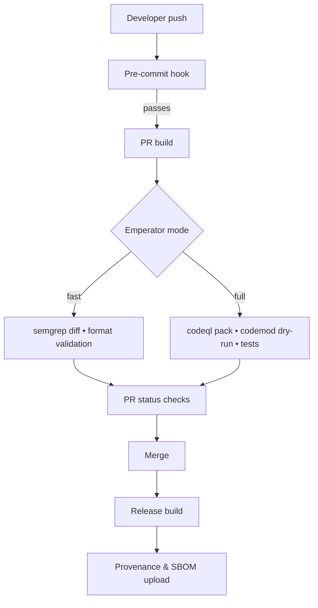

# Integrating Emperator with CI/CD Pipelines

Emperator’s contract enforcement is most effective when it runs consistently from developer workstations through CI, release packaging, and provenance attestation. This guide walks through recommended checkpoints and automation patterns.

## 1. Align local and CI workflows

- Install Emperator and supporting tools (`semgrep`, `codeql`, formatters) in developer environments via `pre-commit` or language-specific toolchains.
- Add the pre-commit hook described in the tutorial so local commits run `emperator apply --diff --color` before code reaches the central repository.
- Encourage developers to run `emperator check --strict --no-fix` in feature branches to preview CI outcomes.

## 2. Stage checks in CI

Use fast checks for pull requests and full checks for protected branches.



Recommended modes:

- **Fast (pull requests):** `emperator apply --diff --no-commit --fast` with Semgrep diff scans, contract validation, and format checkers. Upload SARIF results for inline review comments.
- **Full (mainline):** `emperator apply --strict` plus `emperator test --generators` to run property-based tests or contract-driven scaffolds. Execute CodeQL query packs and produce SBOMs.

## 3. GitHub Actions template

The workspace already includes `.github/workflows/docs-ci.yml` for MkDocs. Extend with a job dedicated to Emperator:

```yaml
name: Emperator Compliance

on:
  pull_request:
 branches: [ main ]
  push:
 branches: [ main ]

jobs:
  emperator:
 runs-on: ubuntu-latest
 steps:
   - uses: actions/checkout@v4

   - name: Set up Python
  uses: actions/setup-python@v4
  with:
    python-version: '3.11'

   - name: Install Emperator toolchain
  run: |
    python -m pip install --upgrade pip
    pip install emperator-cli semgrep
    curl -sSL https://github.com/github/codeql-action/releases/latest/download/codeql-bundle-linux64.tar.gz \
   | tar -xz -C "$HOME"
    echo "CODEQL_HOME=$HOME/codeql" >> "$GITHUB_ENV"

   - name: Run fast contract checks
  run: emperator apply --diff --no-commit --fast

   - name: Upload SARIF
  if: always()
  uses: github/codeql-action/upload-sarif@v2
  with:
    sarif_file: reports/emperator.sarif
```

Adaptations for other CI systems:

- **GitLab CI:** Install dependencies in a shared job and cache the Emperator virtual environment. Use `artifacts:reports:sast` to surface SARIF output in merge requests.
- **Azure DevOps:** Integrate with pipeline tasks to upload SARIF; gate deployments by adding a quality criteria check that requires Emperator success.
- **Jenkins:** Use a pipeline stage with `sh 'emperator apply --strict'` and archive reports for compliance review.

## 4. Generate and publish SBOMs

- Run `emperator sbom --format cyclonedx --output sbom/app.json` after successful checks.
- Upload SBOM artefacts (`actions/upload-artifact`, `gitlab-ci artifacts`, etc.) and attach them to release pipelines.
- Feed SBOMs into vulnerability scanners (such as Dependency-Track) to maintain continuous monitoring.

## 5. Capture provenance

- Generate in-toto attestations: `emperator attest --out provenance/intoto.jsonl` summarizing contract version, Emperator version, and applied rules.
- Sign artefacts using Sigstore Cosign or an internal PKI (`cosign attest --predicate provenance/intoto.jsonl image:tag`).
- Store signatures alongside release artefacts; auditors can later verify that code was produced under a known contract.

## 6. Handle exemptions in pipelines

- Configure Emperator to fail builds if an exemption lacks justification or has expired (`emperator check --strict --enforce-expiry`).
- Export exemption reports to dashboards so compliance teams can track outstanding waivers.

## 7. Monitor performance

- Cache Semgrep and CodeQL databases between runs to keep pipeline times low (`actions/cache` works well for GitHub Actions).
- Run heavy CodeQL packs on nightly builds if PR pipelines need to be faster.
- Record key metrics (issues found, fixes applied, runtime) for trending; Emperator’s JSON output can feed Grafana or DataDog dashboards.

By aligning local enforcement, CI gates, SBOM generation, and provenance, you ensure Emperator’s contract remains authoritative across the entire delivery pipeline.
