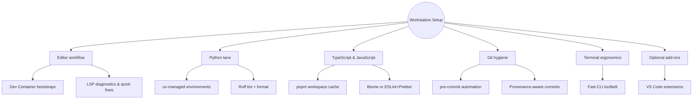

# Developer Tooling Reference

Document the baseline workstation setup that keeps Emperator contributors fast, consistent, and offline-friendly. Pair this page with the [Toolchain Matrix](toolchain.md) and the [Developer Experience overview](../explanation/developer-experience.md) when onboarding new teammates or refreshing local environments.

## Baseline stack {#baseline-stack}

### 1. Editor workflow (reproducible, LSP-centred) {#editor-workflow}

- Rely on Language Server Protocol integrations in VS Code, Neovim, or any LSP-capable editor to surface completion, diagnostics, and codemod-ready code actions.
- Launch projects inside Dev Containers so the editor boots a pre-tooled environment described in `devcontainer.json`; once cached locally the workflow stays reliable offline.
- Track shared formatting defaults via a root-level `.editorconfig` so secondary editors match the same indentation, end-of-line, and charset expectations.

### 2. Python lane (first-class) {#python-lane}

- Use [uv](https://docs.astral.sh/uv/) for package management and virtual environments. It is a drop-in `pip` replacement that produces a universal lockfile and delivers order-of-magnitude speedups.
- Run [Ruff](https://docs.astral.sh/ruff/) for both linting and formatting, aligning with the [Python entry in the Toolchain Matrix](toolchain.md#recommended-lint-and-formatter-stacks). Pair it with `pytest` and `coverage` for fast unit feedback.
- Keep project environments self-contained. Export `UV_VENV_IN_PROJECT=1` (or equivalent `PIPENV_VENV_IN_PROJECT=1` / `poetry config virtualenvs.in-project true`) so your virtual environments live under `.venv/` inside the repository and can be pruned with a single `rm -rf`.

### 3. TypeScript and JavaScript {#typescript-javascript}

- Prefer [pnpm](https://pnpm.io/) workspaces for installs; they keep disk usage low and caching predictable across Dev Containers and CI.
- Reach for [Biome](https://biomejs.dev/) when a single binary can handle lint and format. If framework plugins or bespoke rules are required, fall back to the ESLint plus Prettier combo referenced in the [Toolchain Matrix](toolchain.md#recommended-lint-and-formatter-stacks).
- Use the repo-scoped `.npmrc` (sets `store-dir=./.pnpm-store`) so pnpm’s content-addressable store remains under version control boundaries. Run `pnpm store prune` periodically if you need to reclaim disk space.
- Biome is configured to auto-organise imports, clamp line width to 100 characters, enforce two-space indentation, and prefer double quotes with required semicolons. These defaults keep generated diffs tight and align with the contract examples in [Authoring and Evolving the Project Contract](../how-to/author-contract.md#2-define-structural-conventions-with-cue).
- Bootstrap or re-run the full lint/format toolchain with `pnpm run setup:lint`. The script installs dependencies, installs the `pre-commit` and commit-msg hooks, formats the tree with Biome, and then executes the combined `pnpm lint` pipeline (Biome check + ESLint). In CI or deployment environments, call `pnpm run setup:lint -- --ci` to skip hook installation and avoid write operations while still running the gate checks.
- ESLint remains in place for rules Biome does not yet cover (module boundary policies, import hygiene beyond ordering, etc.). Keep both tools wired into `pre-commit` so contributors see the same failures locally that CI enforces.

### 4. Git hooks, commit hygiene, and PR UX {#git-hygiene}

- Wire up [`pre-commit`](https://pre-commit.com/) (or [Lefthook](https://github.com/evilmartians/lefthook)) to run Ruff, Biome, ShellCheck, yamllint, and other fast checks before code reaches CI.
- Guard commit history with [Conventional Commits](https://www.conventionalcommits.org/) and [`commitlint`](https://commitlint.js.org/) so releases and changelog automation remain deterministic.
- Upload SARIF artefacts during CI (see the [CI integration playbook](../how-to/ci-integration.md#3-github-actions-template)) so findings annotate GitHub pull requests inline.
- Point `PRE_COMMIT_HOME` at `${REPO_ROOT}/.cache/pre-commit` (or use `.envrc`) to keep hook environments alongside the repo. The `.gitignore` already excludes `.cache/`, so caches never show up as dirty files.

### 5. Terminal ergonomics (pleasant, practical) {#terminal-ergonomics}

- Keep the shell minimal yet high-signal: [starship](https://starship.rs/) prompt, [ripgrep](https://github.com/BurntSushi/ripgrep), [fzf](https://github.com/junegunn/fzf), [zoxide](https://github.com/ajeetdsouza/zoxide), [bat](https://github.com/sharkdp/bat), [delta](https://github.com/dandavison/delta), [lazygit](https://github.com/jesseduffield/lazygit), and [glow](https://github.com/charmbracelet/glow).
- Every tool is CLI-first, fast, and runs offline, which keeps parity with Dev Containers and reduces surprises in air-gapped environments.

### 6. Optional but excellent {#optional-additions}

- Install VS Code extensions such as [Error Lens](https://marketplace.visualstudio.com/items?itemName=usernamehw.errorlens) for inline diagnostics and [GitLens](https://marketplace.visualstudio.com/items?itemName=eamodio.gitlens) for history context.
- Build documentation with MkDocs Material (this site) or Sphinx; embed architecture visuals with Mermaid. Align prose and code styling through `.editorconfig` and the docs lint tooling captured in the [automation section of the Toolchain Matrix](toolchain.md#automation-to-keep-this-reference-current).

## Nice visual touches without noise {#visual-touches}

- Tune Error Lens severity colouring and gutter hints so inline diagnostics highlight actionable issues without creating a red wall.
- Surface inline blame and change history via GitLens to avoid tab-hopping during reviews and refactors.
- Enable `git -c core.pager=delta show` (or configure delta globally) for readable terminal diffs that highlight syntax, hunk movement, and word changes.
- Expose Ruff and Biome quick-fixes through the LSP code action menu so deterministic auto-fixes feel instant while staying under the safety gate described in the [AI-assisted refactors guide](../how-to/ai-assisted-refactors.md#lint-aware-fixes).
- Publish PR check summaries with deep links and SARIF annotations so reviewers can jump from dashboards directly to highlighted code in GitHub.

Keep this reference close when setting up new workstations, codifying pre-commit hooks, or refreshing Dev Container definitions. Every recommendation keeps velocity high without compromising the guardrails enforced elsewhere in the Emperator stack.

### Local cache hygiene {#local-cache-hygiene}

- `.pnpm-store/` holds pnpm’s shared packages for this project; delete the folder to force a clean reinstall.
- `.cache/pre-commit/` retains hook environments; run `PRE_COMMIT_HOME=$PWD/.cache/pre-commit pre-commit clean` to reclaim space.
- `.cache/pip/` (or UV’s cache) can be relocated alongside the project with `PIP_CACHE_DIR=$PWD/.cache/pip`, ensuring global home directories stay lean.
