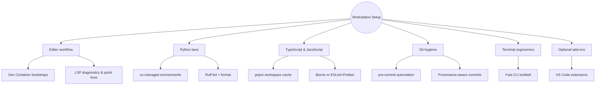

# Developer Tooling Reference

Document the baseline workstation setup that keeps Emperator contributors fast, consistent, and offline-friendly. Pair this page with the [Toolchain Matrix](toolchain.md), the detailed [Linting and Formatting reference](linting-formatting.md), and the [Developer Experience overview](../explanation/developer-experience.md) when onboarding new teammates or refreshing local environments.

## Baseline stack {#baseline-stack}



## Dependency orchestration (Python-first) {#dependency-orchestration}

### Executive setup (TL;DR)

- **Python** &mdash; Declare compatible release ranges with PEP 440’s `~=` operator in `pyproject.toml`, lock with `uv lock`, and keep `.venv/` aligned via `uv sync --frozen`. Schedule (or approve) upgrades to track the newest safe releases and commit `uv.lock`.
- **Node** &mdash; Continue using pnpm with a committed `pnpm-lock.yaml`. In CI run `pnpm install --frozen-lockfile` and prime the store with `pnpm fetch` for deterministic, cache-friendly installs.
- **CI acceleration** &mdash; Cache package-manager stores with GitHub Actions cache entries keyed by the lockfiles. For offline/air-gapped paths, publish a wheelhouse (Python) or vendored store snapshot that cold-start runners can consume without hitting the public registries.

### Python (primary lane)

1. **Declare “latest compatible” correctly** &mdash; use `~=` in `pyproject.toml`:

   ```toml
   [project]
   name = "emperator"
   requires-python = ">=3.11"
   dependencies = [
    "fastapi ~= 0.119",
    "pydantic ~= 2.12",
    "ruff ~= 0.14",
   ]
   ```

   The compatible release operator expresses the intent (“give me the newest patch/minor in this line”) while preserving forwards compatibility guarantees.

2. **Lock and sync the virtual environment with uv**:

   ```bash
   uv lock            # resolves to uv.lock with the latest releases inside the compatible ranges
   uv sync --frozen   # ensures .venv matches the lock exactly
   ```

   `uv` manages `.venv/`, keeps the lock and environment in sync, and ships with offline-friendly, Rust-fast resolution.

3. **CI flow (newest compatible, reproducible)**:

   - Nightly or PR automation: `uv lock --upgrade` (or adjust constraints) to refresh `uv.lock` and commit the result once CI passes.
   - Build/test: skip resolution and run `uv sync --frozen` so ephemeral runners reproduce exactly what the lock declares.

4. **Ephemeral runners and offline/air-gapped installs**:

   - **Cache the store** &mdash; use GitHub Actions cache keyed by `uv.lock` to persist `~/.cache/uv` and `.venv/` across runs.
   - **Ship a wheelhouse** for true offline operation:

     ```bash
     # Build wheelhouse (Linux runner)
     pip wheel --requirement <(uv export --format requirements.txt) -w wheelhouse
     # Later / offline install
     pip install --no-index --find-links=wheelhouse -r <(uv export --format requirements.txt)
     ```

     Repair native wheels with `auditwheel` so the artefacts remain portable. For private mirrors, publish a PEP 503 simple index via devpi, Nexus, or Artifactory.

5. **Keep ranges fresh safely** &mdash; enable Dependabot/Renovate or schedule a `uv lock --upgrade` workflow to capture new releases inside the compatible range, gate them with CI, and merge once green.

6. **Why it works** &mdash; PEP 440 ranges capture intent, `uv.lock` captures reality, and `uv sync --frozen` reproduces it precisely on every runner.

### Node (secondary, but common)

- Commit `pnpm-lock.yaml` and treat it as the single source of truth.
- In CI run:

  ```bash
  pnpm fetch                 # pre-populate the store from the lockfile
  pnpm install --frozen-lockfile
  ```

  `pnpm fetch` primes Docker layers and GitHub caches so installs become almost instant.

- Cache the store keyed by the lockfile:

  ```yaml
  - run: echo "STORE_PATH=$(pnpm store path --silent)" >> $GITHUB_ENV
  - uses: actions/cache@v4
   with:
    path: ${{ env.STORE_PATH }}
    key: pnpm-${{ runner.os }}-${{ hashFiles('**/pnpm-lock.yaml') }}
  ```

### Other ecosystems (parity)

- **Go** &mdash; rely on modules, commit `go.sum`, cache the module + build caches, and run `go mod vendor` (or serve a module proxy) for offline work.
- **Rust** &mdash; commit `Cargo.lock`, cache the Cargo registry, and generate a `vendor/` directory with `cargo vendor` when air-gapped operation is required.
- **Java** &mdash; with Gradle, enable dependency locking (`./gradlew dependencies --write-locks`) and cache `~/.gradle`; with Maven, pre-fetch via `mvn dependency:go-offline` then build with `-o` and cache `~/.m2`.

### CI building blocks

**Python (uv) with cache + wheelhouse fallback**:

```yaml
name: ci-python
on: [push, pull_request]
jobs:
 test:
  runs-on: ubuntu-latest
  steps:
   - uses: actions/checkout@v4
   - name: Install uv
    run: curl -LsSf https://astral.sh/uv/install.sh | sh
   - name: Cache uv (by lockfile)
    uses: actions/cache@v4
    with:
     path: |
      ~/.cache/uv
      .venv
     key: uv-${{ runner.os }}-${{ hashFiles('uv.lock') }}
   - name: Sync venv (reproducible)
    run: ~/.cargo/bin/uv sync --frozen
   - name: Run tests
    run: ~/.cargo/bin/uv run -m pytest -q
   - name: Build wheelhouse
    run: |
     pip wheel -r <(~/.cargo/bin/uv export --format requirements.txt) -w wheelhouse
   - uses: actions/upload-artifact@v4
    with:
     name: wheelhouse
     path: wheelhouse/
```

**Node (pnpm)**:

```yaml
name: ci-node
on: [push, pull_request]
jobs:
 build:
  runs-on: ubuntu-latest
  steps:
   - uses: actions/checkout@v4
   - uses: pnpm/action-setup@v4
    with: { version: 9, run_install: false }
   - name: Get pnpm store path
    run: echo "STORE_PATH=$(pnpm store path --silent)" >> $GITHUB_ENV
   - name: Cache pnpm store
    uses: actions/cache@v4
    with:
     path: ${{ env.STORE_PATH }}
     key: pnpm-${{ runner.os }}-${{ hashFiles('**/pnpm-lock.yaml') }}
   - run: pnpm fetch
   - run: pnpm install --frozen-lockfile
   - run: pnpm test
```

### Private mirrors and provenance

- Front PyPI through a devpi/Nexus/Artifactory mirror to stabilise supply, optionally paired with the wheelhouse artefact for full offline coverage.
- Document why this approach is trustworthy:
  - **Data** &mdash; uv project/lock/sync documentation, the PEP 440 specifier table, and GitHub Actions cache guidance.
  - **Methods** &mdash; compatible release ranges → lockfile → frozen sync in CI; cache the store; fall back to wheelhouse/mirror for cold or offline starts.
  - **Key result** &mdash; newest compatible versions on every update without breaking reproducibility; instant installs on ephemeral runners; offline-capable workflows.
  - **Uncertainty** &mdash; building universal wheels for native packages may require CI images with the right system libraries (use `auditwheel` to repair them).
  - **Safer alternative** &mdash; start with caching only; add wheelhouse or mirror once the critical native dependencies are identified and tested.

### Quick bootstrap (all tooling) {#quick-bootstrap}

- Run `./scripts/setup-tooling.sh` (or `pnpm run setup:tooling`) after cloning. It generates/refreshes `uv.lock`, runs `uv sync --group dev` so `.venv/` aligns with the lockfile, fetches pnpm dependencies (with `pnpm fetch` + `pnpm install --frozen-lockfile` in CI), defers to `setup-linting.sh` for formatter/linter checks, and installs both `pre-commit` and `commit-msg` hooks when not in CI. Pass `--ci` inside automation to skip hook installation while still running the lint pipeline.

### 1. Editor workflow (reproducible, LSP-centred) {#editor-workflow}

- Rely on Language Server Protocol integrations in VS Code, Neovim, or any LSP-capable editor to surface completion, diagnostics, and codemod-ready code actions.
- Launch projects inside Dev Containers so the editor boots a pre-tooled environment described in `devcontainer.json`; once cached locally the workflow stays reliable offline.
- Track shared formatting defaults via a root-level `.editorconfig` so secondary editors match the same indentation, end-of-line, and charset expectations.
- Reuse the checked-in `.vscode/settings.json` to pin Ruff as the Python formatter, Biome as the JSON/JS/TS formatter, and the workspace interpreter at `${workspaceFolder}/.venv/bin/python` for consistent on-save behaviour.
- Use the shared `.vscode/launch.json` debug profiles for `pytest tests`, `emperator scaffold audit`, and `uvicorn emperator.api:app --reload` to reduce task boilerplate across machines.

### 2. Python lane (first-class) {#python-lane}

- Run [Ruff](https://docs.astral.sh/ruff/) for both linting and formatting, aligning with the [Python entry in the Toolchain Matrix](toolchain.md#recommended-lint-and-formatter-stacks). Pair it with `pytest` and `coverage` for fast unit feedback.
- Keep project environments self-contained. Export `UV_VENV_IN_PROJECT=1` (or equivalent `PIPENV_VENV_IN_PROJECT=1` / `poetry config virtualenvs.in-project true`) so your virtual environments live under `.venv/` inside the repository and can be pruned with a single `rm -rf`.

- Prefer [pnpm](https://pnpm.io/) workspaces for installs; they keep disk usage low and caching predictable across Dev Containers and CI.
- Reach for [Biome](https://biomejs.dev/) when a single binary can handle lint and format. If framework plugins or bespoke rules are required, fall back to the ESLint plus Prettier combo referenced in the [Toolchain Matrix](toolchain.md#recommended-lint-and-formatter-stacks).
- Use the repo-scoped `.npmrc` (sets `store-dir=./.pnpm-store`) so pnpm’s content-addressable store remains under version control boundaries. Run `pnpm store prune` periodically if you need to reclaim disk space.
- Biome is configured to auto-organise imports, clamp line width to 100 characters, enforce two-space indentation, and prefer double quotes with required semicolons. These defaults are applied globally via the `formatter` block so any Biome-supported language inherits the same layout conventions and aligns with the contract examples in [Authoring and Evolving the Project Contract](../how-to/author-contract.md#2-define-structural-conventions-with-cue).
- Bootstrap or re-run the full lint/format toolchain with `pnpm run setup:lint`. The script installs dependencies, installs the `pre-commit` and commit-msg hooks, formats the tree with Biome, and then executes the combined `pnpm lint` pipeline (Ruff + Biome + ESLint). In CI or deployment environments, call `pnpm run setup:lint -- --ci` to skip hook installation and avoid write operations while still running the gate checks.
- Reach for `pnpm fmt` for YAML, Biome-managed assets, Python formatting, and Ruff-powered import sorting (`ruff format` + `ruff check --select I --fix`). Append `--all` to enable the broader `ruff check --fix` sweep in the same pass, or `--check` to run the same stack in dry-run mode (no writes, non-zero exit when changes are pending). Ensure `uv` is available (installed via `scripts/setup-tooling.sh`) so the Ruff invocations succeed.
- ESLint remains in place for rules Biome does not yet cover (module boundary policies, import hygiene beyond ordering, etc.). Keep both tools wired into `pre-commit` so contributors see the same failures locally that CI enforces.

### 4. Git hooks, commit hygiene, and PR UX {#git-hygiene}

- Wire up [`pre-commit`](https://pre-commit.com/) (or [Lefthook](https://github.com/evilmartians/lefthook)) to run Ruff, Biome, ShellCheck, yamllint (configured via `.yamllint` while Biome awaits first-party YAML formatting), actionlint, and other fast checks before code reaches CI.
- Guard commit history with [Conventional Commits](https://www.conventionalcommits.org/) and [`commitlint`](https://commitlint.js.org/) so releases and changelog automation remain deterministic.
- Upload SARIF artefacts during CI (see the [CI integration playbook](../how-to/ci-integration.md#3-github-actions-template)) so findings annotate GitHub pull requests inline.
- Point `PRE_COMMIT_HOME` at `${REPO_ROOT}/.cache/pre-commit` (or use `.envrc`) to keep hook environments alongside the repo. The `.gitignore` already excludes `.cache/`, so caches never show up as dirty files.

### 5. Terminal ergonomics (pleasant, practical) {#terminal-ergonomics}

- Keep the shell minimal yet high-signal: [starship](https://starship.rs/) prompt, [ripgrep](https://github.com/BurntSushi/ripgrep), [fzf](https://github.com/junegunn/fzf), [zoxide](https://github.com/ajeetdsouza/zoxide), [bat](https://github.com/sharkdp/bat), [delta](https://github.com/dandavison/delta), [lazygit](https://github.com/jesseduffield/lazygit), and [glow](https://github.com/charmbracelet/glow).
- Every tool is CLI-first, fast, and runs offline, which keeps parity with Dev Containers and reduces surprises in air-gapped environments.

### 6. Optional but excellent {#optional-additions}

- Install VS Code extensions such as [Ruff](https://marketplace.visualstudio.com/items?itemName=charliermarsh.ruff) for Python lint/format integration, [Error Lens](https://marketplace.visualstudio.com/items?itemName=usernamehw.errorlens) for inline diagnostics, [GitLens](https://marketplace.visualstudio.com/items?itemName=eamodio.gitlens) for history context, and the [Python extension](https://marketplace.visualstudio.com/items?itemName=ms-python.python) to power the debug profiles described above.
- Build documentation with MkDocs Material (this site) or Sphinx; embed architecture visuals with Mermaid. Align prose and code styling through `.editorconfig` and the docs lint tooling captured in the [automation section of the Toolchain Matrix](toolchain.md#automation-to-keep-this-reference-current).

## Nice visual touches without noise {#visual-touches}

- Tune Error Lens severity colouring and gutter hints so inline diagnostics highlight actionable issues without creating a red wall.
- Surface inline blame and change history via GitLens to avoid tab-hopping during reviews and refactors.
- Enable `git -c core.pager=delta show` (or configure delta globally) for readable terminal diffs that highlight syntax, hunk movement, and word changes.
- Expose Ruff and Biome quick-fixes through the LSP code action menu so deterministic auto-fixes feel instant while staying under the safety gate described in the [AI-assisted refactors guide](../how-to/ai-assisted-refactors.md#lint-aware-fixes).
- Publish PR check summaries with deep links and SARIF annotations so reviewers can jump from dashboards directly to highlighted code in GitHub.

Keep this reference close when setting up new workstations, codifying pre-commit hooks, or refreshing Dev Container definitions. Every recommendation keeps velocity high without compromising the guardrails enforced elsewhere in the Emperator stack.

### Local cache hygiene {#local-cache-hygiene}

- `.pnpm-store/` holds pnpm’s shared packages for this project; delete the folder to force a clean reinstall.
- `.cache/pre-commit/` retains hook environments; run `PRE_COMMIT_HOME=$PWD/.cache/pre-commit pre-commit clean` to reclaim space.
- `.cache/pip/` (or UV’s cache) can be relocated alongside the project with `PIP_CACHE_DIR=$PWD/.cache/pip`, ensuring global home directories stay lean.
